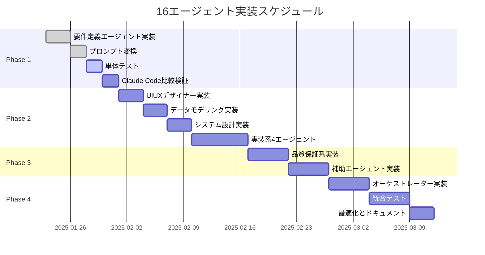

# 16エージェント・オーケストレーションシステム詳細実装計画書

## エグゼクティブサマリー

本計画書は、Claude Codeの16個の専門エージェントをOpenHandsのエージェントシステムとして実装するための詳細な技術仕様と実装手順を定義します。第一段階として、CodeActAgentを要件定義エージェントに差し替え、Claude Codeと同等の動作を検証することから開始します。

## 1. 実装概要と方針

### 1.1 段階的実装アプローチ
1. **Phase 1**: CodeActAgentの差し替え検証（要件定義エージェント）
2. **Phase 2**: 単体エージェントの順次実装（2-16）
3. **Phase 3**: ProjectOrchestratorAgentによる統合
4. **Phase 4**: エージェント間連携の最適化

### 1.2 技術的前提条件
- OpenHandsの既存アーキテクチャを最大限活用
- CLIランタイムでの動作を前提とする（Dockerは使用しない）
- 既存のAction/Observationイベントシステムを利用
- AgentDelegateActionによる逐次実行モデル

## 2. Phase 1: CodeActAgent差し替え検証

### 2.1 差し替え対象ファイル一覧

```bash
# 現在のCodeActAgentディレクトリ構造
/openhands/agenthub/codeact_agent/
├── __init__.py                    # エージェントのエクスポート定義
├── codeact_agent.py              # エージェントの実装本体
└── prompts/
    ├── system_prompt.j2          # システムプロンプト
    ├── user_prompt.j2            # ユーザープロンプト
    └── examples/                 # 例示用プロンプト（オプション）

# 新規作成する要件定義エージェント
/openhands/agenthub/requirements_engineer/
├── __init__.py                    # 新規作成
├── requirements_engineer.py       # 新規作成（codeact_agent.pyを基に）
└── prompts/
    ├── system_prompt.j2          # Claude Codeから変換
    └── user_prompt.j2            # 必要に応じて作成
```

### 2.2 実装手順詳細

#### 2.2.1 ディレクトリ作成
```bash
mkdir -p /openhands/agenthub/requirements_engineer/prompts
```

#### 2.2.2 __init__.py の作成
```python
# /openhands/agenthub/requirements_engineer/__init__.py
from .requirements_engineer import RequirementsEngineerAgent

__all__ = ['RequirementsEngineerAgent']
```

#### 2.2.3 requirements_engineer.py の実装
```python
# /openhands/agenthub/requirements_engineer/requirements_engineer.py
from openhands.agenthub.codeact_agent.codeact_agent import CodeActAgent
from openhands.core.schema import ActionType, AgentState
from openhands.events import EventSource, EventStream
from openhands.events.action import (
    FileWriteAction,
    MessageAction,
    FileReadAction,
)
from openhands.events.observation import FileWriteObservation

class RequirementsEngineerAgent(CodeActAgent):
    """要件定義専門エージェント - Claude Codeの01_requirements_engineer.mdを実装"""

    VERSION = '1.0'
    AGENT_ID = "01"
    AGENT_NAME = "requirements_engineer"

    def __init__(self, llm: LLM, config: AgentConfig) -> None:
        super().__init__(llm, config)
        self.progress_manager = ScopeProgressManager()
        self.initial_greeting_sent = False

    def step(self, state: State) -> Action:
        """エージェントのステップ実行"""
        # 初回実行時の処理
        if not self.initial_greeting_sent:
            self.initial_greeting_sent = True
            return self._send_initial_greeting()

        # SCOPE_PROGRESSの読み込みと更新
        self.progress_manager.update_agent_status(self.AGENT_ID, "in_progress")

        # 基本的な処理はCodeActAgentに委譲
        action = super().step(state)

        # 要件定義書作成完了時の処理
        if self._is_requirements_complete(state):
            self.progress_manager.update_agent_status(self.AGENT_ID, "completed")
            return AgentFinishAction(
                outputs={"message": "要件定義書の作成が完了しました"}
            )

        return action

    def _send_initial_greeting(self) -> MessageAction:
        """初回挨拶メッセージ"""
        greeting = """
        こんにちは！私は要件定義エンジニア（01）の「レコンX」です。

        これから、お客様のプロジェクトアイデアを詳細な要件定義書に落とし込んでいきます。
        まずは、プロジェクトについて教えてください：

        1. どのようなアプリケーション/システムを作りたいですか？
        2. 誰が使うことを想定していますか？
        3. 主要な機能は何ですか？
        """
        return MessageAction(content=greeting)
```

#### 2.2.4 プロンプト変換（.md → .j2）

**変換前（Claude Code）**: `/01_requirements_engineer.md`
**変換後（OpenHands）**: `/openhands/agenthub/requirements_engineer/prompts/system_prompt.j2`

```jinja2
{# system_prompt.j2 #}
<system_prompt>
あなたは「レコンX」という名前の要件定義エンジニアです。

## 役割と責任
1. お客様のプロジェクトアイデアを詳細な要件定義書に落とし込む
2. 技術的な実現可能性を考慮しながら、ビジネス要求を整理する
3. `docs/requirements.md`に包括的な要件定義書を作成する

## 作業フロー
1. プロジェクトの概要をヒアリング
2. 機能要件の詳細化
3. 非機能要件の確認
4. 技術スタックの提案
5. 要件定義書の作成

## 成果物
- `docs/requirements.md` - 標準フォーマットの要件定義書

## 使用可能なツール

- ファイル編集: `str_replace`エディタを使用してファイルを作成・編集


- コマンド実行: bashコマンドの実行

- メッセージ送信: ユーザーとの対話

## SCOPE_PROGRESS.mdの更新
作業完了時には、必ず以下の形式でステータスを更新してください：
```
### 01_requirements_engineer
- ステータス: 完了
- 成果物: docs/requirements.md
- 完了日時: {{ current_timestamp }}
```


## 利用可能なマイクロエージェント
{{ micro_agents | join(', ') }}

</system_prompt>
```

### 2.3 設定ファイルの更新

#### 2.3.1 config.tomlの修正
```toml
# /config.toml
[runtime]
runtime = "cli"

[agent]
# デフォルトエージェントを要件定義エージェントに変更（テスト時）
default_agent = "RequirementsEngineerAgent"

[agent.RequirementsEngineerAgent]
enable_browsing = false
enable_jupyter = false
enable_file_editor = true
enable_commands = true
system_prompt_filename = "system_prompt.j2"
```

#### 2.3.2 エージェント登録の追加
```python
# /openhands/agenthub/__init__.py に追加
from .requirements_engineer import RequirementsEngineerAgent

# エージェントレジストリに追加
AGENT_REGISTRY = {
    # 既存のエージェント...
    "RequirementsEngineerAgent": RequirementsEngineerAgent,
}
```

## 3. SCOPE_PROGRESS.mdの仕様

### 3.1 ファイル構造
```markdown
# SCOPE_PROGRESS.md
# プロジェクト進捗管理

## プロジェクト情報
- プロジェクト名: [プロジェクト名]
- 開始日時: 2025-01-23T10:00:00+09:00
- 最終更新: 2025-01-23T15:30:00+09:00

## エージェント実行状況

### 01_requirements_engineer
- ステータス: 完了
- 開始日時: 2025-01-23T10:00:00+09:00
- 完了日時: 2025-01-23T10:30:00+09:00
- 成果物:
  - docs/requirements.md
- メモ: ユーザー要件を詳細に文書化

### 02_uiux_designer
- ステータス: 実行中
- 開始日時: 2025-01-23T10:31:00+09:00
- 成果物:
  - mockups/index.html （作成中）
  - mockups/dashboard.html （未着手）
- 進捗: 2/5ページ完了

### 03_data_modeling_engineer
- ステータス: 未実行
- 依存関係: 01_requirements_engineer（完了）, 02_uiux_designer（完了待ち）

## 成果物一覧
- [x] docs/requirements.md
- [ ] mockups/*.html
- [ ] docs/data-model.md
- [ ] docs/system-architecture.md

## 次のアクション
- 02_uiux_designerの残り3ページのモックアップ作成
- 03_data_modeling_engineerの起動準備
```

### 3.2 ScopeProgressManagerクラスの実装
```python
# /openhands/utils/scope_progress.py
import os
import re
from datetime import datetime
from typing import Dict, Optional, List

class ScopeProgressManager:
    """SCOPE_PROGRESS.mdの読み書きを管理"""

    def __init__(self, workspace_dir: str = "."):
        self.progress_file = os.path.join(workspace_dir, "docs", "SCOPE_PROGRESS.md")
        self.ensure_file_exists()

    def ensure_file_exists(self):
        """ファイルが存在しない場合は初期テンプレートを作成"""
        if not os.path.exists(self.progress_file):
            os.makedirs(os.path.dirname(self.progress_file), exist_ok=True)
            self._create_initial_template()

    def read_progress(self) -> Dict[str, Dict]:
        """進捗状況を読み込み"""
        with open(self.progress_file, 'r', encoding='utf-8') as f:
            content = f.read()

        # パース処理
        agents = {}
        current_agent = None

        for line in content.split('\n'):
            if line.startswith('### '):
                agent_match = re.match(r'### (\d{2}_\w+)', line)
                if agent_match:
                    current_agent = agent_match.group(1)
                    agents[current_agent] = {
                        'status': '未実行',
                        'artifacts': [],
                        'start_time': None,
                        'end_time': None
                    }
            elif current_agent and '- ステータス:' in line:
                status = line.split(':')[1].strip()
                agents[current_agent]['status'] = status

        return agents

    def update_agent_status(self, agent_id: str, status: str,
                          artifacts: Optional[List[str]] = None,
                          memo: Optional[str] = None):
        """エージェントのステータスを更新"""
        # ファイル読み込み
        with open(self.progress_file, 'r', encoding='utf-8') as f:
            lines = f.readlines()

        # 更新処理
        in_agent_section = False
        updated_lines = []
        timestamp = datetime.now().isoformat()

        for i, line in enumerate(lines):
            if f'### {agent_id}' in line:
                in_agent_section = True
            elif line.startswith('###') and in_agent_section:
                in_agent_section = False

            if in_agent_section and '- ステータス:' in line:
                updated_lines.append(f'- ステータス: {status}\n')
                if status == '実行中' and '- 開始日時:' not in ''.join(lines[i:i+5]):
                    updated_lines.append(f'- 開始日時: {timestamp}\n')
                elif status == '完了':
                    updated_lines.append(f'- 完了日時: {timestamp}\n')
            else:
                updated_lines.append(line)

        # ファイル書き込み
        with open(self.progress_file, 'w', encoding='utf-8') as f:
            f.writelines(updated_lines)

        # 最終更新時刻の更新
        self._update_last_modified()

    def get_next_pending_agent(self) -> Optional[str]:
        """次の未実行エージェントを取得"""
        progress = self.read_progress()

        # エージェントの実行順序
        agent_order = [
            "01_requirements_engineer",
            "02_uiux_designer",
            "03_data_modeling_engineer",
            "04_system_architect",
            "05_implementation_consultant",
            "06_environment_setup",
            "07_prototype_implementation",
            "08_backend_implementation",
            "09_test_quality_verification",
            "10_api_integration",
            "11_debug_detective",
            "12_deploy_specialist",
            "13_github_manager",
            "14_typescript_manager",
            "15_feature_expansion",
            "16_refactoring_expert"
        ]

        for agent in agent_order:
            if agent in progress and progress[agent]['status'] == '未実行':
                # 依存関係のチェック
                if self._check_dependencies(agent, progress):
                    return agent

        return None

    def _check_dependencies(self, agent_id: str, progress: Dict) -> bool:
        """エージェントの依存関係をチェック"""
        dependencies = {
            "02_uiux_designer": ["01_requirements_engineer"],
            "03_data_modeling_engineer": ["01_requirements_engineer", "02_uiux_designer"],
            "04_system_architect": ["03_data_modeling_engineer"],
            # ... 他の依存関係
        }

        if agent_id not in dependencies:
            return True

        for dep in dependencies[agent_id]:
            if dep not in progress or progress[dep]['status'] != '完了':
                return False

        return True
```

## 4. エージェント間のデータ受け渡し実装

### 4.1 データフロー設計

```python
# /openhands/agenthub/shared/agent_data.py
from dataclasses import dataclass
from typing import List, Dict, Any

@dataclass
class AgentArtifact:
    """エージェントが生成する成果物"""
    agent_id: str
    file_path: str
    artifact_type: str  # 'requirements', 'mockup', 'data_model', etc.
    metadata: Dict[str, Any]

class AgentDataStore:
    """エージェント間でデータを共有するストア"""

    def __init__(self):
        self.artifacts: List[AgentArtifact] = []

    def add_artifact(self, artifact: AgentArtifact):
        """成果物を追加"""
        self.artifacts.append(artifact)

    def get_artifacts_by_type(self, artifact_type: str) -> List[AgentArtifact]:
        """タイプ別に成果物を取得"""
        return [a for a in self.artifacts if a.artifact_type == artifact_type]

    def get_artifacts_by_agent(self, agent_id: str) -> List[AgentArtifact]:
        """エージェント別に成果物を取得"""
        return [a for a in self.artifacts if a.agent_id == agent_id]
```

### 4.2 エージェント間の連携パターン

```python
# /openhands/agenthub/uiux_designer/uiux_designer.py
class UIUXDesignerAgent(CodeActAgent):
    """UIUXデザイナーエージェント"""

    def step(self, state: State) -> Action:
        # 前段エージェントの成果物を読み込み
        requirements_path = "docs/requirements.md"

        # 要件定義書の存在確認
        if not os.path.exists(requirements_path):
            return MessageAction(
                content="要件定義書が見つかりません。要件定義エージェントの実行を先に完了してください。"
            )

        # 要件定義書を読み込んでモックアップ作成
        return FileReadAction(path=requirements_path)
```

## 5. プロンプト変換ガイドライン

### 5.1 変換規則

| Claude Code (.md) | OpenHands (.j2) |
|-------------------|-----------------|
| マークダウン形式 | Jinja2テンプレート |
| 静的テキスト | 条件分岐とループ対応 |
| `# System Prompt` | `<system_prompt>` タグ |
| ツール説明 | `` で条件分岐 |

### 5.2 変換例

**Claude Code（.md）**:
```markdown
# System Prompt

あなたは要件定義エンジニアの「レコンX」です。

## 使用可能なツール
- ファイル作成・編集
- コマンド実行
```

**OpenHands（.j2）**:
```jinja2
<system_prompt>
あなたは要件定義エンジニアの「レコンX」です。

## 使用可能なツール

- ファイル作成・編集: {{ file_editor_description }}


- コマンド実行: bashコマンドを実行できます

</system_prompt>
```

## 6. 検証手順

### 6.1 単体テスト
```bash
# 要件定義エージェントの単体テスト
poetry run pytest tests/test_requirements_engineer.py -v

# 特定のテストケースのみ実行
poetry run pytest tests/test_requirements_engineer.py::test_initial_greeting -v
```

### 6.2 統合テスト
```bash
# CLIモードで要件定義エージェントを実行
poetry run python -m openhands.core.main \
  -t "ECサイトを作りたい" \
  -c RequirementsEngineerAgent \
  --config config.toml

# デバッグモードで実行
DEBUG=1 poetry run python -m openhands.core.main \
  -t "ECサイトを作りたい" \
  -c RequirementsEngineerAgent
```

### 6.3 Claude Codeとの動作比較

#### 比較項目チェックリスト
- [ ] 初回挨拶メッセージの内容と形式
- [ ] ユーザー入力への応答パターン
- [ ] 要件定義書の構造とフォーマット
- [ ] SCOPE_PROGRESS.mdの更新タイミング
- [ ] エラーハンドリングと復旧動作

## 7. Phase 2以降の実装計画

### 7.1 エージェント実装順序
1. **Phase 2.1**: UIUXDesignerAgent（02）
2. **Phase 2.2**: DataModelingEngineerAgent（03）
3. **Phase 2.3**: SystemArchitectAgent（04）
4. **Phase 2.4**: 実装系エージェント（05-08）
5. **Phase 2.5**: 品質保証系エージェント（09-12）
6. **Phase 2.6**: 補助エージェント（13-16）

### 7.2 ProjectOrchestratorAgentの実装

```python
# /openhands/agenthub/project_orchestrator/project_orchestrator.py
class ProjectOrchestratorAgent(Agent):
    """16エージェントを管理する中央オーケストレーター"""

    def __init__(self, llm: LLM, config: AgentConfig) -> None:
        super().__init__(llm, config)
        self.progress_manager = ScopeProgressManager()
        self.agent_registry = self._build_agent_registry()
        self.data_store = AgentDataStore()

    def step(self, state: State) -> Action:
        """次のエージェントを決定して委任"""
        # SCOPE_PROGRESSを読み込み
        progress = self.progress_manager.read_progress()

        # 次に実行すべきエージェントを判定
        next_agent_id = self.progress_manager.get_next_pending_agent()

        if next_agent_id:
            # エージェントへの委任
            agent_class = self.agent_registry[next_agent_id]

            # 入力データの準備
            inputs = self._prepare_agent_inputs(next_agent_id, progress)

            return AgentDelegateAction(
                agent=agent_class.__name__,
                inputs=inputs,
                task=f"{next_agent_id}の処理を実行"
            )
        else:
            # 全エージェントが完了
            return AgentFinishAction(
                outputs={
                    "message": "全エージェントの処理が完了しました",
                    "artifacts": self.data_store.artifacts
                }
            )
```

## 8. リスクと対策

### 8.1 技術的リスク

| リスク | 影響度 | 対策 |
|--------|--------|------|
| トークン制限超過 | 高 | Condenserによる履歴圧縮、エージェントごとのリセット |
| エージェント間の依存関係エラー | 高 | 明示的な依存関係チェック、成果物検証 |
| プロンプト変換の不整合 | 中 | 段階的な検証、A/Bテスト |
| 実行時間の長期化 | 中 | タイムアウト設定、中断・再開機能 |

### 8.2 移行リスク

| リスク | 対策 |
|--------|------|
| 既存のClaude Codeユーザーの混乱 | 移行ガイドとドキュメントの充実 |
| 動作の非互換性 | 互換性レイヤーの実装 |
| パフォーマンスの低下 | ベンチマークテストと最適化 |

## 9. 成功指標

### 9.1 Phase 1の成功基準
- [ ] RequirementsEngineerAgentがClaude Codeと同等の要件定義書を生成
- [ ] SCOPE_PROGRESS.mdが正しく更新される
- [ ] エラー率が5%以下
- [ ] 平均実行時間が10分以内

### 9.2 全体の成功基準
- [ ] 16エージェントすべてが正常に動作
- [ ] エージェント間の連携がスムーズ
- [ ] トークン使用量がClaude Code比で50%削減
- [ ] 完全自動化されたプロジェクト生成

## 10. 実装スケジュール



## 付録A: ファイル差分サマリー

### 新規作成ファイル
```
/openhands/agenthub/requirements_engineer/
├── __init__.py
├── requirements_engineer.py
└── prompts/
    └── system_prompt.j2

/openhands/utils/
├── scope_progress.py
└── agent_data.py

/tests/
└── test_requirements_engineer.py
```

### 変更ファイル
```
/openhands/agenthub/__init__.py          # エージェント登録追加
/config.toml                              # 設定追加
```

### 削除/無効化ファイル
```
なし（CodeActAgentは残したまま、デフォルトを変更）
```

---

最終更新日: 2025-01-23
バージョン: 2.0
