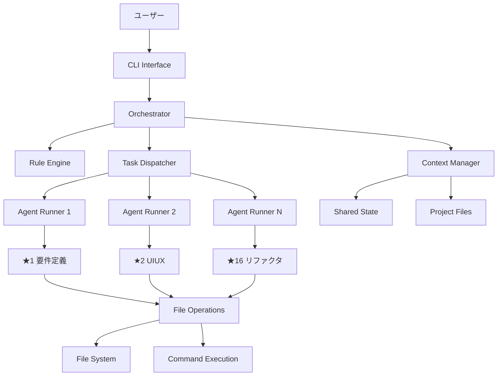
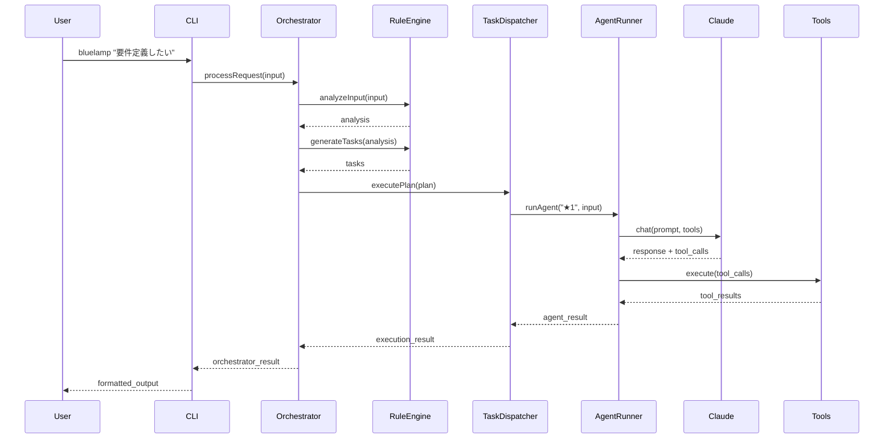
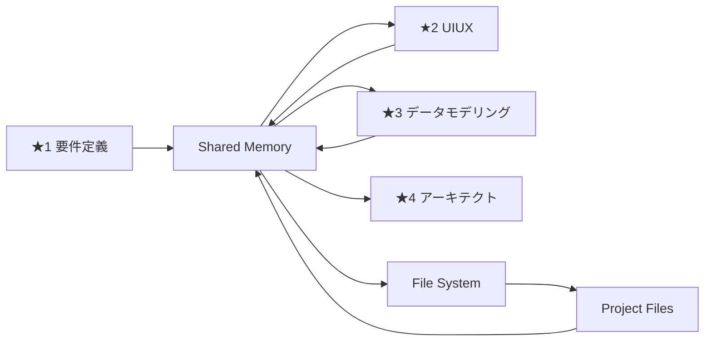

# BlueLamp CLI アーキテクチャ設計書

**バージョン**: 3.0.0
**作成日**: 2025-06-23
**設計思想**: 前回失敗の教訓を活かした堅牢で拡張可能なアーキテクチャ

## 1. アーキテクチャ概要

### 1.1 設計原則

**1. 責任の明確な分離**
- オーケストレーター：ルールベースの制御（AI不使用）
- エージェント：専門的なAI処理（独立セッション）
- ツール：汎用的なファイル・システム操作

**2. 段階的拡張性**
- Phase 1: 単一エージェント実行
- Phase 2: 依存関係管理
- Phase 3: 並列実行・自律制御

**3. 障害耐性**
- 単一エージェント失敗時の継続実行
- 状態保存による中断・再開
- 詳細なログとエラー追跡

### 1.2 システム全体図



## 2. コンポーネント設計

### 2.1 Orchestrator（オーケストレーター）

**責務**: システム全体の制御と調整
**特徴**: ルールベース（AI不使用）でコンテキスト消費を最小化

```typescript
interface Orchestrator {
  // メイン処理フロー
  processRequest(input: UserInput): Promise<OrchestratorResult>

  // ワークフロー管理
  executeWorkflow(workflowName: string, input: UserInput): Promise<WorkflowResult>
  pauseWorkflow(workflowId: string): Promise<void>
  resumeWorkflow(workflowId: string): Promise<WorkflowResult>

  // 状態管理
  getSystemStatus(): SystemStatus
  getWorkflowProgress(workflowId: string): Progress
}

class OrchestratorImpl implements Orchestrator {
  constructor(
    private ruleEngine: RuleEngine,
    private taskDispatcher: TaskDispatcher,
    private contextManager: ContextManager,
    private progressTracker: ProgressTracker
  ) {}

  async processRequest(input: UserInput): Promise<OrchestratorResult> {
    // 1. 入力分析（ルールベース）
    const analysis = await this.ruleEngine.analyzeInput(input)

    // 2. タスク生成
    const tasks = await this.ruleEngine.generateTasks(analysis)

    // 3. 実行計画作成
    const executionPlan = await this.ruleEngine.createExecutionPlan(tasks)

    // 4. タスク実行
    const result = await this.taskDispatcher.executePlan(executionPlan)

    return result
  }
}
```

### 2.2 Rule Engine（ルールエンジン）

**責務**: 入力分析、タスク生成、実行計画作成
**特徴**: 完全にルールベース、設定ファイル駆動

```typescript
interface RuleEngine {
  analyzeInput(input: UserInput): Promise<InputAnalysis>
  generateTasks(analysis: InputAnalysis): Promise<Task[]>
  createExecutionPlan(tasks: Task[]): Promise<ExecutionPlan>
  selectAgent(taskType: TaskType): AgentId
}

// 入力分析ルール
const INPUT_ANALYSIS_RULES = {
  keywords: {
    "要件定義": { agent: "★1", priority: "high" },
    "モックアップ": { agent: "★2", priority: "medium" },
    "データベース": { agent: "★3", priority: "high" },
    "アーキテクチャ": { agent: "★4", priority: "high" },
    "実装": { agent: "★5", priority: "medium" },
    "環境構築": { agent: "★6", priority: "low" },
    "プロトタイプ": { agent: "★7", priority: "medium" },
    "バックエンド": { agent: "★8", priority: "high" },
    "テスト": { agent: "★9", priority: "medium" },
    "API": { agent: "★10", priority: "high" },
    "デバッグ": { agent: "★11", priority: "urgent" },
    "デプロイ": { agent: "★12", priority: "low" },
    "Git": { agent: "★13", priority: "low" },
    "TypeScript": { agent: "★14", priority: "medium" },
    "機能追加": { agent: "★15", priority: "medium" },
    "リファクタリング": { agent: "★16", priority: "low" }
  },
  patterns: {
    "新しいプロジェクト": ["★1", "★2", "★3", "★4", "★5"],
    "既存プロジェクト改善": ["★11", "★14", "★15", "★16"],
    "デプロイ準備": ["★9", "★12", "★13"]
  }
}

// 依存関係ルール
const DEPENDENCY_RULES = {
  "★1": { dependencies: [], outputs: ["requirements.md"] },
  "★2": { dependencies: ["★1"], outputs: ["mockups/"] },
  "★3": { dependencies: ["★1"], outputs: ["data-models.md"] },
  "★4": { dependencies: ["★1", "★3"], outputs: ["architecture.md"] },
  "★5": { dependencies: ["★1", "★2", "★3", "★4"], outputs: ["implementation-plan.md"] },
  // ... 他のエージェント
}
```

### 2.3 Task Dispatcher（タスクディスパッチャー）

**責務**: タスクの実行制御、並列処理管理、リソース管理

```typescript
interface TaskDispatcher {
  executePlan(plan: ExecutionPlan): Promise<ExecutionResult>
  executeTask(task: Task): Promise<TaskResult>
  executeParallel(tasks: Task[]): Promise<TaskResult[]>
  manageResources(): void
}

class TaskDispatcherImpl implements TaskDispatcher {
  private taskQueue: TaskQueue
  private agentRunners: Map<AgentId, AgentRunner>
  private resourceManager: ResourceManager

  async executePlan(plan: ExecutionPlan): Promise<ExecutionResult> {
    const results: TaskResult[] = []

    for (const phase of plan.phases) {
      if (phase.parallel) {
        // 並列実行
        const phaseResults = await this.executeParallel(phase.tasks)
        results.push(...phaseResults)
      } else {
        // 順次実行
        for (const task of phase.tasks) {
          const result = await this.executeTask(task)
          results.push(result)

          // 依存関係チェック
          await this.updateDependencies(result)
        }
      }
    }

    return { results, status: 'completed' }
  }
}
```

### 2.4 Agent Runner（エージェント実行器）

**責務**: 個別エージェントの実行、ツール統合、結果管理

```typescript
interface AgentRunner {
  runAgent(agentId: AgentId, input: AgentInput): Promise<AgentResult>
  loadAgentPrompt(agentId: AgentId): Promise<AgentPrompt>
  executeWithTools(prompt: string, tools: Tool[]): Promise<AgentResult>
}

class AgentRunnerImpl implements AgentRunner {
  constructor(
    private claudeApi: ClaudeApiClient,
    private toolRegistry: ToolRegistry,
    private contextManager: ContextManager
  ) {}

  async runAgent(agentId: AgentId, input: AgentInput): Promise<AgentResult> {
    // 1. エージェントプロンプト読み込み
    const agentPrompt = await this.loadAgentPrompt(agentId)

    // 2. コンテキスト構築
    const context = await this.contextManager.getAgentContext(agentId)
    const fullPrompt = this.buildFullPrompt(agentPrompt, input, context)

    // 3. 利用可能ツール取得
    const tools = this.toolRegistry.getToolsForAgent(agentId)

    // 4. Claude API実行
    const response = await this.claudeApi.chat(fullPrompt, {
      tools: tools.map(t => t.definition),
      max_tokens: 32000
    })

    // 5. ツール実行
    const toolResults = await this.executeTools(response.tool_calls)

    // 6. 結果統合
    const result = this.buildAgentResult(response, toolResults)

    // 7. コンテキスト更新
    await this.contextManager.updateAgentContext(agentId, result)

    return result
  }

  private async executeTools(toolCalls: ToolCall[]): Promise<ToolResult[]> {
    const results: ToolResult[] = []

    for (const call of toolCalls) {
      const tool = this.toolRegistry.getTool(call.name)
      const result = await tool.execute(call.parameters)
      results.push(result)
    }

    return results
  }
}
```

### 2.5 Context Manager（コンテキスト管理）

**責務**: エージェント間のコンテキスト共有、状態管理、メモリ最適化

```typescript
interface ContextManager {
  getAgentContext(agentId: AgentId): Promise<AgentContext>
  updateAgentContext(agentId: AgentId, result: AgentResult): Promise<void>
  getSharedContext(): Promise<SharedContext>
  updateSharedContext(updates: ContextUpdate[]): Promise<void>
  optimizeMemory(): Promise<void>
}

interface SharedContext {
  projectInfo: ProjectInfo
  currentPhase: DevelopmentPhase
  completedTasks: TaskResult[]
  projectFiles: ProjectFile[]
  globalState: GlobalState
}

class ContextManagerImpl implements ContextManager {
  private agentContexts: Map<AgentId, AgentContext> = new Map()
  private sharedContext: SharedContext
  private memoryOptimizer: MemoryOptimizer

  async getAgentContext(agentId: AgentId): Promise<AgentContext> {
    const agentContext = this.agentContexts.get(agentId) || this.createEmptyContext(agentId)

    // 共有コンテキストから関連情報を取得
    const relevantSharedInfo = await this.extractRelevantInfo(agentId, this.sharedContext)

    return {
      ...agentContext,
      sharedInfo: relevantSharedInfo,
      projectFiles: this.getRelevantFiles(agentId),
      previousResults: this.getPreviousResults(agentId)
    }
  }

  async optimizeMemory(): Promise<void> {
    // 古いコンテキストの要約
    for (const [agentId, context] of this.agentContexts) {
      if (context.messages.length > 50) {
        const summarized = await this.memoryOptimizer.summarizeContext(context)
        this.agentContexts.set(agentId, summarized)
      }
    }

    // 不要なファイル情報の削除
    await this.cleanupOldFiles()
  }
}
```

## 3. ツールシステム設計

### 3.1 Tool Registry（ツール登録）

```typescript
interface Tool {
  name: string
  description: string
  definition: ToolDefinition
  execute(parameters: any): Promise<ToolResult>
}

class FileOperationTool implements Tool {
  name = "file_operations"
  description = "ファイルの読み書き、編集、検索"

  definition = {
    type: "function",
    function: {
      name: "file_operations",
      description: "ファイル操作を実行",
      parameters: {
        type: "object",
        properties: {
          operation: { type: "string", enum: ["read", "write", "edit", "search", "list"] },
          path: { type: "string" },
          content: { type: "string" },
          pattern: { type: "string" }
        }
      }
    }
  }

  async execute(parameters: any): Promise<ToolResult> {
    switch (parameters.operation) {
      case "read":
        return await this.readFile(parameters.path)
      case "write":
        return await this.writeFile(parameters.path, parameters.content)
      case "edit":
        return await this.editFile(parameters.path, parameters.changes)
      case "search":
        return await this.searchFiles(parameters.pattern, parameters.directory)
      case "list":
        return await this.listFiles(parameters.path)
      default:
        throw new Error(`Unknown operation: ${parameters.operation}`)
    }
  }
}

class CommandExecutionTool implements Tool {
  name = "command_execution"
  description = "システムコマンドの実行"

  async execute(parameters: any): Promise<ToolResult> {
    const { command, workingDirectory, timeout = 30000 } = parameters

    return await this.executeCommand(command, {
      cwd: workingDirectory,
      timeout,
      captureOutput: true
    })
  }
}
```

### 3.2 Progress Tracking（進捗追跡）

```typescript
interface ProgressTracker {
  startTask(taskId: string, agentId: AgentId): void
  updateProgress(taskId: string, progress: number, message?: string): void
  completeTask(taskId: string, result: TaskResult): void
  failTask(taskId: string, error: Error): void
  getOverallProgress(): OverallProgress
}

class ProgressTrackerImpl implements ProgressTracker {
  private tasks: Map<string, TaskProgress> = new Map()
  private eventEmitter: EventEmitter

  updateProgress(taskId: string, progress: number, message?: string): void {
    const task = this.tasks.get(taskId)
    if (task) {
      task.progress = progress
      task.message = message
      task.lastUpdate = new Date()

      // リアルタイム更新
      this.eventEmitter.emit('progress', {
        taskId,
        agentId: task.agentId,
        progress,
        message
      })

      // コンソール表示更新
      this.updateConsoleDisplay()
    }
  }

  private updateConsoleDisplay(): void {
    // 進捗バーの更新
    console.clear()
    for (const [taskId, task] of this.tasks) {
      if (task.status === 'running') {
        const progressBar = this.createProgressBar(task.progress)
        console.log(`🟢 ${task.agentId} ${task.agentName}`)
        console.log(`├── ${task.message || 'Processing...'}`)
        console.log(`└── ${progressBar} ${task.progress}%`)
        console.log()
      }
    }
  }
}
```

## 4. データフロー設計

### 4.1 実行フロー



### 4.2 コンテキスト共有フロー



## 5. エラーハンドリング設計

### 5.1 エラー分類

```typescript
enum ErrorType {
  USER_INPUT_ERROR = "user_input_error",
  AGENT_EXECUTION_ERROR = "agent_execution_error",
  TOOL_EXECUTION_ERROR = "tool_execution_error",
  SYSTEM_ERROR = "system_error",
  NETWORK_ERROR = "network_error",
  CONTEXT_ERROR = "context_error"
}

interface BlueLampError {
  type: ErrorType
  message: string
  agentId?: AgentId
  taskId?: string
  originalError?: Error
  recoverable: boolean
  suggestedAction?: string
}
```

### 5.2 エラー処理戦略

```typescript
class ErrorHandler {
  async handleError(error: BlueLampError): Promise<ErrorHandlingResult> {
    switch (error.type) {
      case ErrorType.AGENT_EXECUTION_ERROR:
        return await this.handleAgentError(error)

      case ErrorType.TOOL_EXECUTION_ERROR:
        return await this.handleToolError(error)

      case ErrorType.NETWORK_ERROR:
        return await this.handleNetworkError(error)

      default:
        return await this.handleGenericError(error)
    }
  }

  private async handleAgentError(error: BlueLampError): Promise<ErrorHandlingResult> {
    if (error.recoverable) {
      // リトライ戦略
      return {
        action: 'retry',
        retryCount: 3,
        retryDelay: 5000
      }
    } else {
      // 代替エージェント選択
      return {
        action: 'fallback',
        fallbackAgent: this.selectFallbackAgent(error.agentId)
      }
    }
  }
}
```

## 6. 設定管理設計

### 6.1 設定ファイル構造

```json
// config/agents.json
{
  "agents": {
    "★1": {
      "name": "要件定義エンジニア",
      "promptFile": "01-requirements-engineer.md",
      "tools": ["file_operations", "command_execution"],
      "maxTokens": 32000,
      "timeout": 300000
    }
  }
}

// config/workflows.json
{
  "workflows": {
    "basic-development": {
      "name": "基本開発フロー",
      "phases": [
        {
          "name": "設計フェーズ",
          "parallel": false,
          "tasks": ["★1", "★2", "★3", "★4"]
        },
        {
          "name": "実装フェーズ",
          "parallel": true,
          "tasks": ["★6", "★7"],
          "dependencies": ["設計フェーズ"]
        }
      ]
    }
  }
}

// config/system.json
{
  "claude": {
    "apiKey": "${CLAUDE_API_KEY}",
    "model": "claude-3-7-sonnet-20250219",
    "maxTokens": 32000,
    "timeout": 60000
  },
  "system": {
    "maxConcurrentAgents": 3,
    "contextOptimizationInterval": 300000,
    "logLevel": "info",
    "resultsDirectory": "./results"
  }
}
```

## 7. パフォーマンス最適化

### 7.1 メモリ最適化

```typescript
class MemoryOptimizer {
  async optimizeAgentContext(context: AgentContext): Promise<AgentContext> {
    // 古いメッセージの要約
    if (context.messages.length > 50) {
      const summary = await this.summarizeMessages(context.messages.slice(0, -20))
      return {
        ...context,
        messages: [
          { role: 'system', content: `Previous conversation summary: ${summary}` },
          ...context.messages.slice(-20)
        ]
      }
    }
    return context
  }

  async optimizeSharedContext(sharedContext: SharedContext): Promise<SharedContext> {
    // 不要なファイル情報の削除
    const relevantFiles = sharedContext.projectFiles.filter(file =>
      file.lastAccessed > Date.now() - 24 * 60 * 60 * 1000 // 24時間以内
    )

    return {
      ...sharedContext,
      projectFiles: relevantFiles
    }
  }
}
```

### 7.2 並列実行最適化

```typescript
class ParallelExecutionOptimizer {
  async optimizeTaskExecution(tasks: Task[]): Promise<ExecutionPlan> {
    // 依存関係グラフ作成
    const dependencyGraph = this.buildDependencyGraph(tasks)

    // 並列実行可能なタスクグループ特定
    const parallelGroups = this.identifyParallelGroups(dependencyGraph)

    // リソース制約を考慮した実行計画作成
    return this.createOptimizedPlan(parallelGroups)
  }
}
```

## 8. 監視・ログ設計

### 8.1 ログ構造

```typescript
interface LogEntry {
  timestamp: string
  level: LogLevel
  component: string
  agentId?: AgentId
  taskId?: string
  message: string
  metadata?: any
}

class Logger {
  info(component: string, message: string, metadata?: any): void
  warn(component: string, message: string, metadata?: any): void
  error(component: string, message: string, error?: Error): void
  debug(component: string, message: string, metadata?: any): void
}
```

### 8.2 メトリクス収集

```typescript
interface SystemMetrics {
  totalTasks: number
  completedTasks: number
  failedTasks: number
  averageExecutionTime: number
  memoryUsage: number
  activeAgents: number
}

class MetricsCollector {
  collectSystemMetrics(): SystemMetrics
  collectAgentMetrics(agentId: AgentId): AgentMetrics
  exportMetrics(format: 'json' | 'prometheus'): string
}
```

---

このアーキテクチャ設計書は、前回の失敗を踏まえた堅牢で拡張可能な設計を提供します。段階的実装により、確実に動作するシステムを構築できます。
