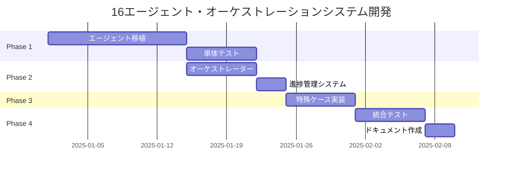

# 16エージェント・オーケストレーションシステム実装計画書

## 1. 概要

### 1.1 プロジェクト背景
- **現状**: 16個の専門エージェントがClaude Codeの初期コンテキストとして個別に動作
- **目標**: OpenHandsのエージェントシステムとして統合し、自動オーケストレーションを実現
- **利点**: トークン効率化、自動進行、専門性の分離

### 1.2 システムアーキテクチャ
```
ProjectOrchestratorAgent（中央マネージャー）
    ├── 01-RequirementsEngineerAgent（要件定義）
    ├── 02-UIUXDesignerAgent（モックアップ作成）
    ├── 03-DataModelingEngineerAgent（データモデル設計）
    ├── 04-SystemArchitectAgent（システム設計）
    ├── 05-ImplementationConsultantAgent（実装計画）
    ├── 06-EnvironmentSetupAgent（環境構築）
    ├── 07-PrototypeImplementationAgent（プロトタイプ実装）
    ├── 08-BackendImplementationAgent（バックエンド実装）
    ├── 09-TestQualityVerificationAgent（テスト検証）
    ├── 10-APIIntegrationAgent（API統合）
    ├── 11-DebugDetectiveAgent（デバッグ）
    ├── 12-DeploySpecialistAgent（デプロイ）
    ├── 13-GitHubManagerAgent（GitHub管理）
    ├── 14-TypeScriptManagerAgent（TypeScript管理）
    ├── 15-FeatureExpansionAgent（機能拡張）
    └── 16-RefactoringExpertAgent（リファクタリング）
```

## 2. 実装フェーズ

### Phase 1: 基盤構築（1-2週間）

#### 1.1 単体エージェントの移植
- [ ] RequirementsEngineerAgentの実装とテスト
- [ ] UIUXDesignerAgentの実装とテスト
- [ ] 各エージェントのプロンプト変換（.md → .j2）
- [ ] Claude Codeとの動作比較検証

#### 1.2 ディレクトリ構造
```bash
/openhands/agenthub/
├── project_orchestrator/           # 中央マネージャー
│   ├── __init__.py
│   ├── orchestrator_agent.py
│   └── prompts/
│       └── system_prompt.j2
├── requirements_engineer/          # 01: 要件定義
│   ├── __init__.py
│   ├── requirements_engineer.py
│   └── prompts/
│       └── system_prompt.j2
├── uiux_designer/                 # 02: UIUXデザイン
│   ├── __init__.py
│   ├── uiux_designer.py
│   └── prompts/
│       └── system_prompt.j2
└── ... (他の14エージェント)
```

### Phase 2: オーケストレーション実装（1週間）

#### 2.1 ProjectOrchestratorAgentの開発
```python
class ProjectOrchestratorAgent(Agent):
    """16エージェントを管理する中央オーケストレーター"""

    VERSION = '1.0'

    AGENT_SEQUENCE = [
        "RequirementsEngineerAgent",
        "UIUXDesignerAgent",
        "DataModelingEngineerAgent",
        # ... 全16エージェント
    ]

    def step(self, state: State) -> Action:
        # SCOPE_PROGRESSを読み込み
        progress = self.read_scope_progress()

        # 次に実行すべきエージェントを判定
        next_agent = self.determine_next_agent(progress)

        if next_agent:
            return AgentDelegateAction(
                agent=next_agent,
                inputs=self.prepare_agent_inputs(next_agent)
            )
        else:
            return AgentFinishAction(
                outputs={"message": "全エージェントの処理が完了しました"}
            )
```

#### 2.2 進捗管理システム
```python
class ScopeProgressManager:
    """SCOPE_PROGRESS.mdの読み書きを管理"""

    def __init__(self):
        self.progress_file = "docs/SCOPE_PROGRESS.md"

    def read_progress(self) -> dict:
        """進捗状況を読み込み"""
        pass

    def update_agent_status(self, agent_id: str, status: str):
        """エージェントのステータスを更新"""
        pass

    def get_next_pending_agent(self) -> str:
        """次の未実行エージェントを取得"""
        pass
```

### Phase 3: 特殊ケースの実装（1週間）

#### 3.1 複数ページモックアップ対応
```python
class UIUXDesignerAgent(Agent):
    def handle_multiple_pages(self, state):
        """要件定義書から複数ページを処理"""
        pages = self.extract_pages_from_requirements()

        for i, page in enumerate(pages):
            self.create_mockup(page)
            self.update_progress(f"mockup_page_{i+1}", "completed")
```

#### 3.2 条件分岐エージェント
```python
# デバッグが必要な場合のみ実行
if self.has_errors():
    return AgentDelegateAction(agent="DebugDetectiveAgent")
```

### Phase 4: テストと検証（1週間）

#### 4.1 単体テスト
```python
# tests/test_requirements_engineer.py
def test_requirements_engineer_agent():
    """要件定義エージェントの単体テスト"""
    agent = RequirementsEngineerAgent(llm=mock_llm, config=config)

    # 初期応答のテスト
    action = agent.step(initial_state)
    assert isinstance(action, MessageAction)
    assert "レコンX" in action.content
```

#### 4.2 統合テスト
```python
# tests/test_orchestration.py
def test_full_orchestration():
    """16エージェントの完全な実行テスト"""
    orchestrator = ProjectOrchestratorAgent(llm=llm, config=config)

    # 完了まで実行
    controller = AgentController(agent=orchestrator)
    controller.run_until_complete()

    # 全成果物の確認
    assert os.path.exists("docs/requirements.md")
    assert os.path.exists("mockups/")
    # ... 他の成果物
```

## 3. 実装詳細

### 3.1 エージェント間のデータフロー
```yaml
RequirementsEngineer:
  output: docs/requirements.md

UIUXDesigner:
  input: docs/requirements.md
  output: mockups/*.html

DataModelingEngineer:
  input:
    - docs/requirements.md
    - mockups/*.html
  output: docs/data-model.md
```

### 3.2 設定ファイル（config.toml）
```toml
[runtime]
runtime = "cli"

[agent]
default_agent = "ProjectOrchestratorAgent"

# 各エージェントの設定
[agent.RequirementsEngineerAgent]
enable_browsing = false
enable_jupyter = false
system_prompt_filename = "requirements_engineer.j2"

[agent.UIUXDesignerAgent]
enable_browsing = false
enable_jupyter = false
system_prompt_filename = "uiux_designer.j2"

# ... 他のエージェント設定
```

### 3.3 エラーハンドリング
```python
class ProjectOrchestratorAgent(Agent):
    def handle_agent_failure(self, agent_name: str, error: Exception):
        """エージェントの失敗を処理"""
        self.log_error(f"{agent_name} failed: {error}")

        # リトライ可能か判定
        if self.is_retryable(error):
            return self.retry_agent(agent_name)
        else:
            return self.skip_to_next_agent()
```

## 4. 移行戦略

### 4.1 段階的移行
1. **Week 1-2**: 要件定義とUIUXデザイナーの2エージェント連携
2. **Week 3**: データモデル〜実装計画（5エージェント）
3. **Week 4**: 実装系エージェント（7-10）
4. **Week 5**: 品質保証〜デプロイ（11-12）
5. **Week 6**: 補助エージェント（13-16）

### 4.2 既存プロジェクトへの適用
```python
# 既存プロジェクトの移行スクリプト
def migrate_existing_project(project_path: str):
    """既存のClaude Codeプロジェクトを移行"""
    # 1. 既存の成果物を確認
    # 2. SCOPE_PROGRESSを生成
    # 3. 未完了のステップから再開
```

## 5. 成功指標

### 5.1 機能要件
- [ ] 16エージェントすべてが個別に動作
- [ ] オーケストレーターが自動的に進行管理
- [ ] SCOPE_PROGRESSが正確に更新される
- [ ] エラー時の適切なリカバリー

### 5.2 非機能要件
- [ ] 各エージェントの実行時間が妥当（5-30分/エージェント）
- [ ] トークン使用量がClaude Code比で50%以下
- [ ] 中断からの再開が可能
- [ ] ログが適切に記録される

## 6. リスクと対策

### 6.1 技術的リスク
| リスク | 影響度 | 対策 |
|--------|--------|------|
| エージェント間の依存関係エラー | 高 | 成果物の検証機能を実装 |
| トークン制限への到達 | 中 | Condenser機能の活用 |
| 実行時間の長期化 | 中 | タイムアウトと中断機能 |

### 6.2 運用リスク
- **学習コスト**: 詳細なドキュメントとサンプルを準備
- **デバッグの困難さ**: 各エージェントの独立したログ機能
- **成果物の品質**: レビュー機能の組み込み

## 7. 今後の拡張

### 7.1 並列実行対応
- 将来的にOpenHandsが並列実行をサポートした場合の設計
- モックアップの並列作成
- テストの並列実行

### 7.2 カスタムエージェントの追加
- プラグイン形式での新エージェント追加
- ドメイン特化エージェントの開発
- コミュニティエージェントの統合

## 8. 開発スケジュール



## 9. 必要なリソース

### 9.1 開発環境
- Python 3.12+
- OpenHands最新版
- 十分なディスク容量（成果物保存用）

### 9.2 LLM要件
- GPT-4またはClaude 3.5 Sonnet推奨
- 各エージェントで異なるモデルの使用も可能

## 10. 連絡先・サポート

- プロジェクトリポジトリ: [GitHubリンク]
- 技術的な質問: [Issueトラッカー]
- ドキュメント: [Wikiリンク]

---

最終更新日: 2025-01-23
バージョン: 1.0
