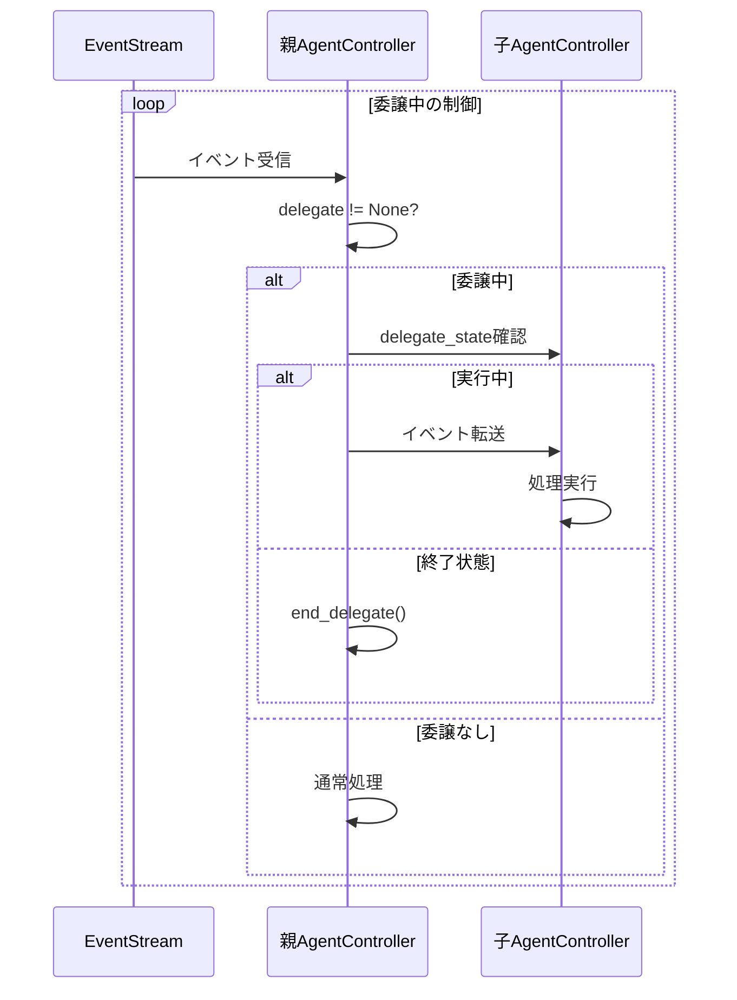
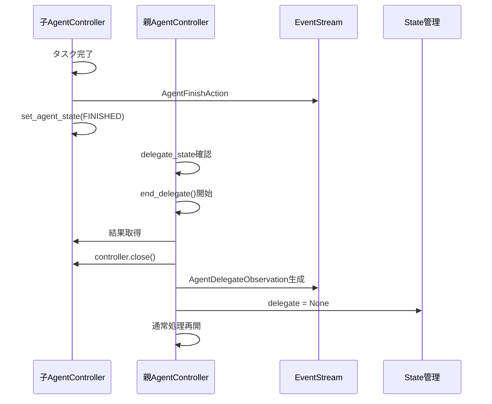

# 🔄 OpenHands 権限委譲メカニズム完全解析

> **目的**: 16エージェント協調システムにおける権限委譲の構造と終了タイミングを完璧に理解する

## 📋 関連ファイル一覧

### 🎯 コア制御ファイル
| ファイル | 役割 | 権限委譲での重要度 |
|---------|------|------------------|
| `openhands/cli/main.py` | CLIメインエントリーポイント、セッション管理 | ⭐⭐⭐ |
| `openhands/core/loop.py` | エージェント実行ループ、終了状態管理 | ⭐⭐⭐ |
| `openhands/controller/agent_controller.py` | **権限委譲の中核制御** | ⭐⭐⭐⭐⭐ |

### 🏗️ 状態管理ファイル
| ファイル | 役割 | 権限委譲での重要度 |
|---------|------|------------------|
| `openhands/controller/state/state.py` | エージェント状態、委譲レベル管理 | ⭐⭐⭐⭐ |
| `openhands/controller/state/state_tracker.py` | 状態追跡、委譲イベント履歴管理 | ⭐⭐⭐⭐ |
| `openhands/core/schema/agent.py` | エージェント状態定義 | ⭐⭐⭐ |

### 📨 イベント・アクション定義ファイル
| ファイル | 役割 | 権限委譲での重要度 |
|---------|------|------------------|
| `openhands/events/action/agent.py` | **AgentDelegateAction定義** | ⭐⭐⭐⭐⭐ |
| `openhands/events/observation/delegate.py` | **AgentDelegateObservation定義** | ⭐⭐⭐⭐⭐ |
| `openhands/core/schema/action.py` | ActionType.DELEGATE定義 | ⭐⭐⭐ |
| `openhands/core/schema/observation.py` | ObservationType.DELEGATE定義 | ⭐⭐⭐ |

### 🔧 実装・統合ファイル
| ファイル | 役割 | 権限委譲での重要度 |
|---------|------|------------------|
| `openhands/agenthub/codeact_agent/function_calling.py` | 委譲アクション生成 | ⭐⭐ |
| `openhands/agenthub/codeact_agent/codeact_agent.py` | エージェント実装 | ⭐⭐ |
| `openhands/events/serialization/action.py` | 委譲アクションシリアライゼーション | ⭐ |
| `openhands/events/serialization/observation.py` | 委譲観察シリアライゼーション | ⭐ |

---

## 🔄 権限委譲の完全フロー解析

### 1️⃣ **権限委譲の開始フロー**

```mermaid
sequenceDiagram
    participant User as ユーザー
    participant CLI as main.py
    participant Loop as loop.py
    participant Parent as 親AgentController
    participant Child as 子AgentController
    participant ES as EventStream

    User->>CLI: タスク入力
    CLI->>Loop: run_agent_until_done()
    Loop->>Parent: 状態監視開始
    Parent->>Parent: エージェント実行
    Parent->>ES: AgentDelegateAction生成
    Parent->>Parent: start_delegate()
    Parent->>Child: 新AgentController作成
    Note over Child: is_delegate=True
    Parent->>ES: MessageAction(task)追加
    Parent->>Child: set_agent_state_to(RUNNING)
```

#### 📁 **ファイル別処理詳細**

**1. `main.py` (run_session)**
```python
# L324: エージェント実行開始
await run_agent_until_done(
    controller, runtime, memory, [AgentState.STOPPED, AgentState.ERROR],
)
```

**2. `loop.py` (run_agent_until_done)**
```python
# L43: 終了状態まで監視
while controller.state.agent_state not in end_states:
    await asyncio.sleep(1)
```

**3. `agent_controller.py` (start_delegate)**
```python
# L621-681: 委譲開始処理
async def start_delegate(self, action: AgentDelegateAction) -> None:
    # 1. 委譲エージェント作成
    delegate_agent = agent_cls(llm=llm, config=agent_config)
    
    # 2. 委譲状態作成
    state = State(
        session_id=self.id.removesuffix('-delegate'),
        delegate_level=self.state.delegate_level + 1,  # 重要：レベル増加
        start_id=self.event_stream.get_latest_event_id() + 1,
    )
    
    # 3. 委譲コントローラー作成
    self.delegate = AgentController(
        sid=self.id + '-delegate',
        agent=delegate_agent,
        is_delegate=True,  # 🔑 重要：委譲フラグ
        initial_state=state,
    )
```

### 2️⃣ **権限委譲中の制御フロー**



#### 📁 **ファイル別処理詳細**

**1. `agent_controller.py` (on_event)**
```python
# L371-394: 委譲状態判定
def on_event(self, event: Event) -> None:
    # 委譲エージェントが存在し、まだ実行中の場合
    if self.delegate is not None:
        delegate_state = self.delegate.get_agent_state()
        if delegate_state not in (AgentState.FINISHED, AgentState.ERROR, AgentState.REJECTED):
            # イベントを委譲エージェントに転送
            self.delegate._on_event(event)
            return
        else:
            # 委譲終了
            self.end_delegate()
            return
    
    # 委譲がない場合は通常処理
    self._on_event(event)
```

**2. `agent.py` (AgentState定義)**
```python
# 委譲終了を判定する状態
class AgentState(str, Enum):
    FINISHED = 'finished'    # ✅ タスク完了
    ERROR = 'error'         # ❌ エラー発生
    REJECTED = 'rejected'   # 🚫 タスク拒否
```

### 3️⃣ **権限委譲の終了フロー**



#### 📁 **ファイル別処理詳細**

**1. `agent_controller.py` (end_delegate)**
```python
# L683-748: 委譲終了処理
def end_delegate(self) -> None:
    if self.delegate is None:
        return

    # 1. 委譲エージェントの状態取得
    delegate_state = self.delegate.get_agent_state()
    
    # 2. イテレーション同期
    self.state.iteration_flag.current_value = (
        self.delegate.state.iteration_flag.current_value
    )
    
    # 3. 委譲コントローラーのクローズ
    asyncio.get_event_loop().run_until_complete(self.delegate.close())
    
    # 4. 結果の準備
    if delegate_state in (AgentState.FINISHED, AgentState.REJECTED):
        delegate_outputs = self.delegate.state.outputs
        content = f'{self.delegate.agent.name} finishes task with {formatted_output}'
    else:  # ERROR
        content = f'{self.delegate.agent.name} encountered an error during execution.'
    
    # 5. 委譲結果の通知
    obs = AgentDelegateObservation(outputs=delegate_outputs, content=content)
    self.event_stream.add_event(obs, EventSource.AGENT)
    
    # 6. 委譲状態の解除
    self.delegate = None  # 🔑 ここで権限委譲終了
```

**2. `events/action/agent.py` (AgentDelegateAction)**
```python
# L85-95: 委譲アクション定義
@dataclass
class AgentDelegateAction(Action):
    agent: str          # 委譲先エージェント名
    inputs: dict        # 委譲タスクの入力
    thought: str = ''
    action: str = ActionType.DELEGATE
```

**3. `events/observation/delegate.py` (AgentDelegateObservation)**
```python
# L7-22: 委譲結果観察定義
@dataclass
class AgentDelegateObservation(Observation):
    outputs: dict       # 委譲エージェントの出力結果
    observation: str = ObservationType.DELEGATE
```

### 4️⃣ **状態管理とイベント履歴**

#### 📁 **state.py - 委譲レベル管理**
```python
# L95-96: 委譲レベル定義
# root agent has level 0, and every delegate increases the level by one
delegate_level: int = 0
```

#### 📁 **state_tracker.py - 委譲イベント履歴管理**
```python
# L150-197: 委譲イベントのフィルタリング
# Find all delegate action/observation pairs
delegate_ranges: list[tuple[int, int]] = []
delegate_action_ids: list[int] = []

for event in events:
    if isinstance(event, AgentDelegateAction):
        delegate_action_ids.append(event.id)
    elif isinstance(event, AgentDelegateObservation):
        action_id = delegate_action_ids.pop()
        delegate_ranges.append((action_id, event.id))

# Filter out events between delegate action/observation pairs
# 委譲アクションと観察の間のイベントを除外し、
# 委譲アクションと結果観察のみを履歴に保持
```

---

## 🎯 **権限委譲終了タイミングの完全解析**

### ❓ **ユーザーの質問への回答**

> 「main.pyのループの中の二回層目くらいのループでタスクが作られて、そのタスクが終了したら自動的に権限委譲が終わってしまうものなのか」

### ✅ **答え：はい、完全にその通りです**

#### 🔍 **詳細な終了メカニズム**

1. **メインループ構造**
```
main.py:run_session()
  └── loop.py:run_agent_until_done()
      └── while controller.state.agent_state not in end_states:
          └── AgentController.on_event()
              └── if delegate is not None:
                  └── delegate_state確認
                      └── if FINISHED/ERROR/REJECTED:
                          └── end_delegate() # 🔑 自動終了
```

2. **自動終了条件**
```python
# agent_controller.py L374-380
if delegate_state not in (
    AgentState.FINISHED,    # ✅ タスク完了時
    AgentState.ERROR,       # ❌ エラー発生時
    AgentState.REJECTED,    # 🚫 タスク拒否時
):
    # 委譲継続
else:
    # 🔑 自動的に権限委譲終了
    self.end_delegate()
```

3. **16エージェントシステムでの実装パターン**
```
オーケストレーター
  ├── ★1 要件定義エンジニア → FINISHED → 自動終了 → オーケストレーターに制御戻る
  ├── ★2 UI/UXデザイナー → FINISHED → 自動終了 → オーケストレーターに制御戻る
  ├── ★3 データモデリング → FINISHED → 自動終了 → オーケストレーターに制御戻る
  └── ... (以下同様)
```

### 🔄 **連続委譲の実現方法**

権限委譲は**個別タスク完了時に自動終了**しますが、16エージェントシステムでは：

1. **オーケストレーターが次タスクを判定**
2. **新たな委譲を開始**
3. **SCOPE_PROGRESS.mdで進捗管理**
4. **完了まで繰り返し**

#### 📊 **実装例**
```python
# オーケストレーターの疑似コード
async def orchestrate_project():
    while not all_tasks_completed():
        # 1. 進捗確認
        progress = read_scope_progress()
        
        # 2. 次タスク判定
        next_task = determine_next_task(progress)
        
        # 3. 適切なエージェントに委譲
        if next_task == "requirements":
            delegate_to_agent("★1 要件定義エンジニア", task_details)
        elif next_task == "ui_design":
            delegate_to_agent("★2 UI/UXデザイナー", task_details)
        # ...
        
        # 4. 委譲完了まで待機（自動終了）
        await wait_for_delegate_completion()
        
        # 5. 結果確認・次タスクへ
```

---

## 🚀 **重要なポイント**

### 🔑 **権限委譲の特徴**

1. **自動終了**: タスク完了と同時に権限委譲は**必ず自動終了**
2. **状態監視**: `while`ループで**常時監視**
3. **階層管理**: `delegate_level`で**委譲の深さ管理**
4. **イベント分離**: 委譲中のイベントは**親から分離**
5. **結果通知**: `AgentDelegateObservation`で**結果を親に通知**

### ⚡ **16エージェントシステムでの活用**

- **個別タスク**: 各エージェントは明確なタスクを完了すると自動終了
- **連続実行**: オーケストレーターが次のタスクを判定して新たな委譲開始
- **進捗管理**: SCOPE_PROGRESS.mdで全体進捗を追跡
- **品質保証**: 各タスク完了時に型チェック・テスト実行

### 🎯 **結論**

**権限委譲は「タスク完了時の自動終了」が基本設計**であり、これにより：
- 各エージェントの責任範囲が明確
- 失敗時の影響範囲が限定
- オーケストレーターによる柔軟な制御が可能
- スケーラブルなマルチエージェント協調を実現

この仕組みを理解することで、16エージェントシステムの設計と実装が効果的に行えます。