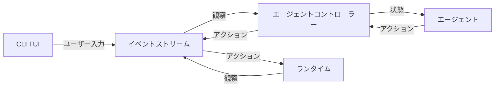
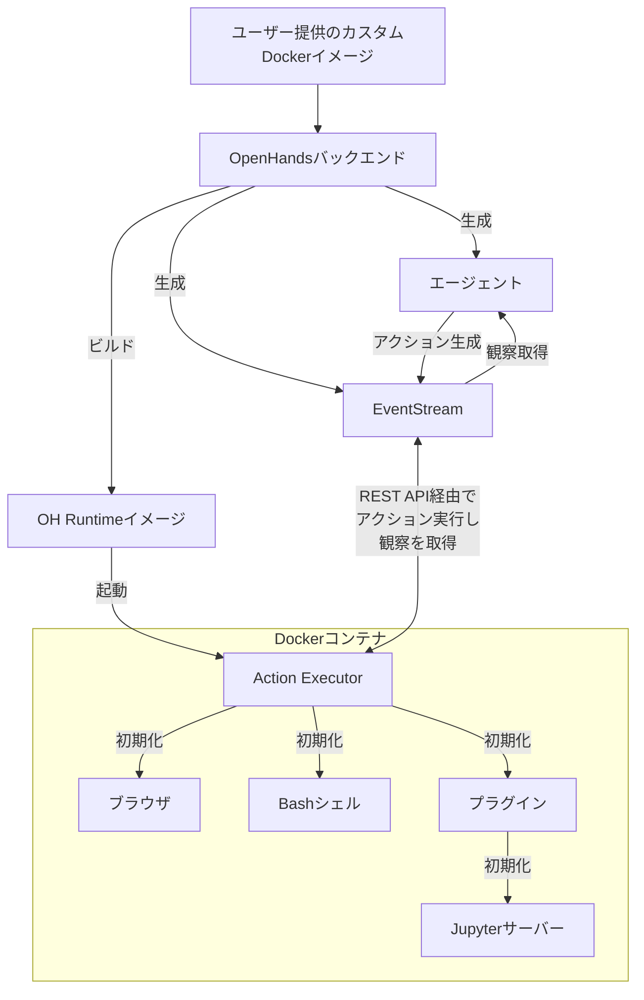

# OpenHands アーキテクチャ

このディレクトリには、OpenHandsのコアコンポーネントが含まれています。

この図は、各コンポーネントの役割と、それらがどのように通信・連携するかの概要を示しています。


## クラス

OpenHandsの主要なクラスは以下の通りです：

| クラス名 | 役割 | 詳細 |
|---------|------|------|
| **LLM** | 大規模言語モデルとの相互作用を仲介 | LiteLLMのおかげで、あらゆる基盤となる補完モデルと連携可能 |
| **Agent** | 現在の状態を確認し、アクションを生成 | 最終目標に一歩近づくアクションを生成する責任 |
| **AgentController** | エージェントの制御とメインループ | エージェントを初期化し、状態を管理し、段階的に前進させる |
| **State** | エージェントのタスクの現在状態 | 現在のステップ、最近のイベント履歴、長期計画などを含む |
| **EventStream** | イベントの中央ハブ | 任意のコンポーネントがイベントを公開・監視可能 |
| **Runtime** | アクションの実行と観察の送信 | アクションを実行し、観察を送り返す責任 |
| **Server** | HTTP経由でのセッション仲介 | フロントエンドを駆動するためのHTTP仲介 |

### イベントシステム

| 要素 | 種類 | 説明 |
|------|------|------|
| **Event** | 基底クラス | アクションまたは観察の基底 |
| **Action** | イベント | ファイル編集、コマンド実行、メッセージ送信などのリクエスト |
| **Observation** | イベント | 環境から収集された情報（ファイル内容、コマンド出力など） |

### ランタイムコンポーネント

| コンポーネント | 役割 | 詳細 |
|---------------|------|------|
| **Sandbox** | コマンド実行環境 | Docker内でのコマンド実行など |
| **Session** | セッション管理 | 単一のEventStream、AgentController、Runtimeを保持 |
| **ConversationManager** | 会話管理 | アクティブセッションのリスト保持とルーティング |

## 制御フロー

エージェントを駆動する基本的なループ（疑似コード）：

```python
while True:
  prompt = agent.generate_prompt(state)
  response = llm.completion(prompt)
  action = agent.parse_response(response)
  observation = runtime.run(action)
  state = state.update(action, observation)
```

実際には、これらの大部分はEventStreamを介したメッセージパッシングによって実現されます。
EventStreamは、OpenHandsにおけるすべての通信のバックボーンとして機能します。



## ランタイムアーキテクチャ

OpenHands Docker Runtimeは、AIエージェントのアクションを安全かつ柔軟に実行できるコアコンポーネントです。
Dockerを使用してサンドボックス環境を作成し、ホストシステムにリスクを与えることなく任意のコードを安全に実行できます。

### なぜサンドボックス化されたランタイムが必要なのか？

OpenHandsが安全で隔離された環境で任意のコードを実行する必要がある理由：

| 理由 | 説明 |
|------|------|
| **セキュリティ** | 信頼できないコードの実行は、ホストシステムに重大なリスクをもたらす可能性があります。サンドボックス環境により、悪意のあるコードがホストシステムのリソースにアクセスしたり変更したりすることを防ぎます |
| **一貫性** | サンドボックス環境により、異なるマシンや設定間でのコード実行の一貫性が保証され、「私のマシンでは動く」問題を排除します |
| **リソース制御** | サンドボックス化により、リソース割り当てと使用量をより適切に制御でき、暴走プロセスがホストシステムに影響を与えることを防ぎます |
| **隔離** | 異なるプロジェクトやユーザーが、互いやホストシステムに干渉することなく隔離された環境で作業できます |
| **再現性** | サンドボックス環境により、実行環境が一貫性があり制御可能であるため、バグや問題の再現が容易になります |

### ランタイムの動作原理

OpenHands Runtimeシステムは、Dockerコンテナで実装されたクライアント・サーバーアーキテクチャを使用します。動作概要：



#### 実行フロー

| ステップ | 説明 |
|---------|------|
| **1. ユーザー入力** | ユーザーがカスタムベースDockerイメージを提供 |
| **2. イメージビルド** | OpenHandsがユーザー提供イメージをベースに新しいDockerイメージ（「OH runtimeイメージ」）をビルド。このイメージにはOpenHands固有のコード（主に「runtimeクライアント」）が含まれる |
| **3. コンテナ起動** | OpenHands開始時に、OH runtimeイメージを使用してDockerコンテナを起動 |
| **4. Action Execution Server初期化** | アクション実行サーバーがコンテナ内で`ActionExecutor`を初期化し、bashシェルなどの必要なコンポーネントを設定し、指定されたプラグインを読み込み |
| **5. 通信** | OpenHandsバックエンド（`openhands/runtime/impl/eventstream/eventstream_runtime.py`）がRESTful API経由でアクション実行サーバーと通信し、アクションを送信して観察を受信 |
| **6. アクション実行** | runtimeクライアントがバックエンドからアクションを受信し、サンドボックス環境で実行し、観察を送り返す |
| **7. 観察返却** | アクション実行サーバーが実行結果を観察としてOpenHandsバックエンドに送信 |

#### クライアントの役割

| 機能 | 説明 |
|------|------|
| **仲介** | OpenHandsバックエンドとサンドボックス環境間の仲介役 |
| **実行** | 様々なタイプのアクション（シェルコマンド、ファイル操作、Pythonコードなど）をコンテナ内で安全に実行 |
| **状態管理** | 現在の作業ディレクトリや読み込まれたプラグインを含む、サンドボックス環境の状態を管理 |
| **フォーマット** | 観察をバックエンドに返却し、結果処理のための一貫したインターフェースを保証 |

### OH Runtimeイメージのビルドと保守

OpenHandsのランタイムイメージのビルドと管理アプローチは、本番環境と開発環境の両方でDockerイメージを作成・保守する際の効率性、一貫性、柔軟性を保証します。

詳細に興味がある場合は、[関連コード](https://github.com/All-Hands-AI/OpenHands/blob/main/openhands/runtime/utils/runtime_build.py)をご確認ください。

#### イメージタグシステム

OpenHandsは、再現性と柔軟性のバランスを取るために、ランタイムイメージに3つのタグシステムを使用します。
タグは以下の2つの形式のいずれかになります：

| タグタイプ | 形式 | 例 |
|-----------|------|-----|
| **Versioned Tag** | `oh_v{openhands_version}_{base_image}` | `oh_v0.9.9_nikolaik_s_python-nodejs_t_python3.12-nodejs22` |
| **Lock Tag** | `oh_v{openhands_version}_{16_digit_lock_hash}` | `oh_v0.9.9_1234567890abcdef` |
| **Source Tag** | `oh_v{openhands_version}_{16_digit_lock_hash}_{16_digit_source_hash}` | `oh_v0.9.9_1234567890abcdef_1234567890abcdef` |

##### Source Tag - 最も具体的

ソースディレクトリのディレクトリハッシュのMD5の最初の16桁です。これにより、openhandsソースのみのハッシュが得られます。

##### Lock Tag

このハッシュは以下のMD5の最初の16桁から構築されます：

- イメージがビルドされたベースイメージの名前（例：`nikolaik/python-nodejs:python3.12-nodejs22`）
- イメージに含まれる`pyproject.toml`の内容
- イメージに含まれる`poetry.lock`の内容

これにより、ソースコードとは独立したOpenhandsの依存関係のハッシュが効果的に得られます。

##### Versioned Tag - 最も汎用的

このタグは、openhandsバージョンとベースイメージ名（タグ標準に適合するよう変換）の連結です。

#### ビルドプロセス

イメージ生成時の優先順位：

| 優先度 | 条件 | 動作 | 説明 |
|--------|------|------|------|
| **1. 再ビルドなし** | 同じ**最も具体的なsource tag**のイメージが存在 | 既存イメージを使用 | ビルドは実行されない |
| **2. 最速再ビルド** | **汎用lock tag**のイメージが存在 | lock tagベースでビルド | `poetry install`や`apt-get`などのインストールステップをバイパスし、現在のソースコードをコピーする最終操作のみ実行。新しいイメージは**source**タグのみでタグ付け |
| **3. 普通の再ビルド** | **source**も**lock**タグも存在しない | versioned tagベースでビルド | versioned tagイメージでは、ほとんどの依存関係が既にインストールされているため時間を節約 |
| **4. 最遅再ビルド** | 3つのタグすべてが存在しない | ベースイメージから新規ビルド | より遅い操作。新しいイメージは**source**、**lock**、**versioned**タグすべてでタグ付け |

このタグアプローチにより、OpenHandsは開発環境と本番環境の両方を効率的に管理できます：

1. 同一のソースコードとDockerfileは常に同じイメージを生成（ハッシュベースタグ経由）
2. 軽微な変更が発生した際に、システムは迅速にイメージを再ビルド可能（最近の互換イメージを活用）
3. **lock**タグ（例：`runtime:oh_v0.9.3_1234567890abcdef`）は、特定のベースイメージ、依存関係、OpenHandsバージョンの組み合わせの最新ビルドを常に指す

### ランタイムプラグインシステム

OpenHands Runtimeは、機能拡張とランタイム環境のカスタマイズを可能にするプラグインシステムをサポートしています。プラグインは、runtimeクライアントの起動時に初期化されます。

独自のプラグインを実装したい場合は、[Jupyterプラグインの例](https://github.com/All-Hands-AI/OpenHands/blob/ecf4aed28b0cf7c18d4d8ff554883ba182fc6bdd/openhands/runtime/plugins/jupyter/__init__.py#L21-L55)をご確認ください。

*プラグインシステムの詳細はまだ構築中です - 貢献を歓迎します！*

#### プラグインシステムの主要側面

| 側面 | 説明 |
|------|------|
| **プラグイン定義** | プラグインは、ベース`Plugin`クラスを継承するPythonクラスとして定義 |
| **プラグイン登録** | 利用可能なプラグインは`ALL_PLUGINS`辞書に登録 |
| **プラグイン指定** | プラグインは`Agent.sandbox_plugins: list[PluginRequirement]`に関連付け。ユーザーはランタイム初期化時に読み込むプラグインを指定可能 |
| **初期化** | プラグインは、runtimeクライアント開始時に非同期で初期化 |
| **使用** | runtimeクライアントは、初期化されたプラグインを使用して機能を拡張可能（例：IPythonセル実行のためのJupyterPlugin） |

`Runtime`について詳しく学ぶには、[ドキュメント](https://docs.all-hands.dev/usage/architecture/runtime)を参照してください。

---

# OpenHands CLI リファクタリングプロジェクト

## プロジェクト概要

OpenHands（旧OpenDevin）は、AI駆動のソフトウェア開発エージェントプラットフォームです。このプロジェクトは**サブスクリプション加入者向けの対話型CLIアプリケーション**として配布予定で、コマンドラインから直接AIエージェントと対話できます。

## ルートディレクトリファイル一覧

### 設定・ビルドファイル

| ファイル名 | 役割 | CLI関連性 | 配布必要性 |
|-----------|------|----------|-----------|
| `pyproject.toml` | Pythonプロジェクトの設定ファイル。依存関係、ビルド設定、CLIエントリーポイント（`openhands`）を定義 | **高** - CLIコマンドのエントリーポイントを定義 | **必須** |
| `poetry.lock` | Poetry依存関係のロックファイル。再現可能なビルドを保証 | **中** - CLI実行に必要な依存関係を固定 | **必須** |
| `config.template.toml` | OpenHandsの設定テンプレートファイル。API キー、ワークスペース設定等 | **高** - CLI動作の設定を定義 | **必須** |
| `MANIFEST.in` | パッケージング時のファイル包含制御。.j2テンプレート等の非Pythonファイルを含める | **高** - CLI動作に必要なテンプレートファイル包含 | **必須** |
| `pytest.ini` | テスト環境設定。142個のテストファイルの実行設定 | **中** - 品質保証 | **保持** |
| `build.sh` | Poetry を使用したビルドスクリプト | **低** - パッケージング用 | **保持** |

## 主要ディレクトリ

| ディレクトリ名 | 役割 | CLI関連性 |
|--------------|------|----------|
| `openhands/` | メインのPythonパッケージ。エージェント、コントローラー、CLI実装を含む | **最高** - CLI実装の中核 |
| `openhands/cli/` | **対話型CLIの実装**。main.py、commands.py、tui.pyを含む | **最高** - CLI機能の直接実装 |
| `docs/` | プロジェクトドキュメント | **中** - CLI使用方法を含む |
| `tests/` | テストスイート | **中** - CLI機能のテスト |

| `microagents/` | 特定タスク用のマイクロエージェント定義 | **高** - CLI経由で利用可能 |
| `dev_config/` | 開発環境設定 | **低** - 開発ツール設定 |

### openhands/ ディレクトリ詳細

#### 高CLI関連性（CLI動作に必須）

| ディレクトリ名 | 役割 | CLI関連性 | 配布必要性 |
|--------------|------|----------|-----------|
| `openhands/cli/` | **対話型CLIの直接実装**。main.py、commands.py、tui.py、settings.py等 | **最高** - CLI機能の中核 | **必須** |
| `openhands/core/` | コア機能。設定、ログ、メッセージ処理、メインループ等 | **最高** - CLI動作の基盤 | **必須** |
| `openhands/controller/` | エージェント制御ロジック。agent_controller.py、action_parser.py等 | **最高** - エージェント実行制御 | **必須** |
| `openhands/events/` | イベントシステム。Action/Observation、EventStream等 | **最高** - エージェント通信の中核 | **必須** |
| `openhands/llm/` | 言語モデル統合。LLM接続、ストリーミング、メトリクス等 | **最高** - AI機能の中核 | **必須** |
| `openhands/memory/` | エージェントメモリ管理。会話履歴、コンテキスト管理等 | **最高** - 対話継続に必須 | **必須** |
| `openhands/microagent/` | 特化エージェント機能。プロンプト、タイプ定義等 | **高** - 専門タスク対応 | **必須** |
| `openhands/runtime/` | 実行環境。コマンド実行、ブラウザ操作、Docker等 | **最高** - アクション実行基盤 | **必須** |

#### 中CLI関連性（機能拡張・品質向上）

| ディレクトリ名 | 役割 | CLI関連性 | 配布必要性 |
|--------------|------|----------|-----------|
| `openhands/agenthub/` | 各種エージェント実装。codeact、browsing、dummy等 | **高** - エージェント選択肢 | **必須** |
| `openhands/storage/` | データ永続化。会話保存、ファイル管理等 | **中** - データ保持機能 | **必須** |
| `openhands/security/` | セキュリティ機能。アクション解析、制限等 | **中** - 安全性確保 | **必須** |
| `openhands/io/` | 入出力処理。JSON、ファイルI/O等 | **中** - データ交換 | **必須** |

#### 低CLI関連性（特定用途・開発支援）

| ディレクトリ名 | 役割 | CLI関連性 | 配布必要性 |
|--------------|------|----------|-----------|
| `openhands/server/` | 型定義のみ（AppMode等）。Web機能は削除済み | **高** - 型定義として必要 | **最小化済み** |
| `openhands/integrations/` | 外部サービス連携。GitHub、GitLab、Bitbucket等 | **中** - 特定機能で使用 | **保持** |
| `openhands/resolver/` | 課題解決機能。PR作成、パッチ適用等 | **中** - 特定タスクで使用 | **保持** |
| `openhands/utils/` | ユーティリティ関数 | **中** - 補助機能 | **保持** |
| `openhands/critic/` | コードレビュー機能。finish_critic.py等 | **低** - 特定用途 | **削除候補** |
| `openhands/linter/` | コードリンティング機能 | **低** - 開発支援 | **削除候補** |
| `openhands/mcp/` | Model Context Protocol実装 | **低** - 特定プロトコル | **削除候補** |

#### 設定・メタファイル

| ファイル名 | 役割 | CLI関連性 | 配布必要性 |
|-----------|------|----------|-----------|
| `openhands/__init__.py` | パッケージ初期化、バージョン管理 | **高** - パッケージ定義 | **必須** |
| `openhands/py.typed` | 型情報マーカー | **低** - 開発支援 | **保持** |
| `openhands/README.md` | アーキテクチャ説明 | **低** - ドキュメント | **削除候補** |

### 現在の課題

**配布関係の複雑性**: 元々オープンソースプロジェクトとして設計されているため、配布用にカスタマイズしようとすると以下の問題が発生：

- 不要な関連ファイルが多数存在
- 開発用設定とプロダクション用設定が混在
- 依存関係が複雑で配布パッケージが肥大化
- ドキュメントや設定ファイルが散在してカスタマイズが困難

### 解決アプローチ

**段階的リファクタリング**: まず構成を綺麗に整理してからカスタマイズ・配布を行う：

1. **Phase 1: クリーンアップ** - 不要ファイル削除、構成整理
2. **Phase 2: カスタマイズ** - サブスク向け機能追加・調整  
3. **Phase 3: 配布準備** - 難読化、パッケージング、配布設定

### **Phase 1: クリーンアップ（現在実施中）**
1. **不要ファイル削除**: オープンソース関連ファイル（README、LICENSE、CONTRIBUTING等）の除去
2. **構成整理**: 開発用設定と配布用設定の分離・整理
3. **依存関係最適化**: 不要な依存関係の削除、配布パッケージの軽量化
4. **CLI特化**: 対話型CLI機能に特化したシンプルな構成

#### **実施済みクリーンアップ**

**Phase 1: 基盤整備** (2024年7月5日)
- ✅ **frontend/ディレクトリ完全削除**
  - 607ファイル、62,661行削除
  - React.jsベースのWebフロントエンド除去
  - CLI単体動作に特化

- ✅ **Pythonバージョン設定修正**
  - pyproject.toml: "^3.9,<3.14" → "^3.12,<3.14"
  - Poetry環境: Python 3.12.11使用

- ✅ **型エラー完全修正**
  - mypy CLI関連: 0エラー達成
  - 型アノテーション完全対応

- ✅ **コード品質改善**
  - ruff: 17,279エラー → 0エラー
  - 引用符スタイル統一（ダブル→シングル）
  - 1,628個のQ000エラー修正

**Phase 2: server/最小化** (2024年7月5日)
- ✅ **server/ディレクトリ最小化**
  - 43ファイル、6,155行削除
  - Web機能完全除去（FastAPI、ルート、セッション）
  - 型定義のみ保持（AppMode、エラー型）
  - CLI機能維持・動作確認済み

**累積削除統計**
```
frontend/: 607ファイル、62,661行削除
server/:    43ファイル、 6,155行削除
─────────────────────────────────────
合計:      650ファイル、68,816行削除
```

#### **残された課題**

**Phase 3: テスト・実験機能整理** (予定)
- ⚠️ **tests/unit/内のserver依存テスト修正**
  - 25ファイルがserver/への依存を持つ
  - 削除されたserver機能のテスト除去が必要
  
- 🔍 **openhands/experiments/削除検討**
  - 実験的機能（A/Bテスト、実験管理）
  - CLI配布では不要な可能性

- 🔍 **最終ビルドテスト**
  - poetry build動作確認
  - 配布パッケージサイズ確認

#### **リファクタリング手順**

**実行済み手順** (参照: 実際のコミット履歴)
1. **構造調査**: `find`、`grep`でディレクトリ構成・依存関係分析
2. **影響範囲確認**: CLI機能への影響をテストで確認
3. **段階的削除**: frontend/ → server/ の順で削除実行
4. **型定義保持**: 必要最小限の型定義（AppMode等）のみ残す
5. **動作確認**: 各段階でCLI機能の動作確認
6. **品質チェック**: ruff、mypy による品質確認
7. **変更コミット**: 段階的にコミット・プッシュ

**使用したコマンド例**
```bash
# 構造調査
find openhands/server/ -name "*.py" | wc -l
find openhands/server/ -name "*.py" -exec wc -l {} + | tail -1

# 依存関係調査  
grep -r "from openhands\.server\|import.*openhands\.server" . --include="*.py"

# 段階的削除
find openhands/server/ -name "*.py" ! -name "types.py" ! -name "__init__.py" -delete

# 動作確認
poetry run openhands --help
poetry run ruff check openhands/
```

### **Phase 2: カスタマイズ（予定）**
1. **サブスク機能追加**: 認証、ライセンス管理、使用量制限等
2. **UI/UX改善**: サブスク加入者向けの使いやすさ向上
3. **機能拡張**: 独自機能の追加・既存機能の改良

### **Phase 3: 配布準備（予定）**
1. **難読化**: Claude Codeスタイルの難読化実装
2. **パッケージング**: PyInstaller等での実行ファイル化
3. **配布システム**: 自動配布・アップデート機能の実装

## リファクタリング方法

### **原則: ミニマリスト**
**徹底的に不要な情報を削ぎ落とす** - CLI配布に必要最小限の構成のみ残す

### **Step 1: ユーザー理解の促進**
指定されたディレクトリにあるファイル一覧を調査し、以下の観点でドキュメント化：

```bash
# ディレクトリ内ファイル調査
ls -la target_directory/
# 各ファイルの役割確認
cat filename
# CLI関連性の判定
grep -r "filename" openhands/cli/
```

**ドキュメント更新内容:**
- ファイル名と役割
- CLI関連性（高/中/低/無関係）
- 配布必要性（必須/保持/削除候補）
- 簡潔な説明

### **Step 2: ユーザーとの対話**
ユーザーからの質問に答えてユーザー理解を促進：

- **ファイルの役割説明**: 「このファイルは何をするものですか？」
- **削除影響の説明**: 「削除するとどうなりますか？」
- **代替手段の提案**: 「他の方法はありますか？」
- **削除判定の支援**: 不要と判断すれば削除実行

```bash
# 実験的削除・検証
mv filename filename.backup
poetry build && openhands --help
# 問題なければ削除確定
rm filename.backup
```

### **Step 3: ドキュメント同期**
削除したファイルの情報をドキュメントからも削除：

- 該当ファイルの記載を表から除去
- 関連する説明文を削除
- ファイル数やディレクトリ構成を更新
- 参考情報の更新

### **判定基準**
- **削除対象**: README、LICENSE、CONTRIBUTING、開発用設定等
- **保持対象**: CLI動作、ビルド、テンプレート、設定ファイル
- **要検証**: 依存関係があるが用途不明なファイル

### **複数エージェント対応**
- 同じ手順で一貫した判定
- ドキュメント更新の標準化
- ミニマリスト原則の徹底


## 対話型CLI機能

このプロジェクトの**主要な特徴は対話型CLIアプリケーション**であることです：

### CLIエントリーポイント
- `openhands` - メインCLIコマンド

### CLI実装場所
- `openhands/cli/main.py` - CLIのメインエントリーポイント
- `openhands/cli/tui.py` - テキストユーザーインターフェース
- `openhands/cli/commands.py` - CLIコマンド処理
- `openhands/cli/settings.py` - CLI設定管理

### 対話機能
- プロンプトベースの対話
- リアルタイムエージェント実行状況表示
- ストリーミング出力
- 使用量メトリクス表示

## 配布方法

### 難読化配布
- Claude Codeスタイルの難読化を実施
- ソースコードの可読性を意図的に低下
- サブスクリプション加入者向けの商用配布

### パッケージング
- PyInstaller等での実行ファイル化
- 依存関係の同梱
- クロスプラットフォーム対応

## 参考情報

このドキュメントは以下のソースファイルを基に作成・更新されました：
- `pyproject.toml` - プロジェクト設定とCLIエントリーポイント定義
- `openhands/cli/main.py` - CLI実装の確認
- `MANIFEST.in` - パッケージング設定の確認
- `pytest.ini` - テスト設定の確認
- `openhands/__init__.py` - パッケージ初期化とバージョン管理の確認
- `openhands/README.md` - OpenHandsアーキテクチャ概要の確認
- `openhands/` ディレクトリ構造の直接調査（find、ls コマンド使用）
- 各サブディレクトリの役割分析（CLI関連性の判定）
- プロジェクトディレクトリ構造の直接調査
- 2024年12月7日 - サブスク加入者向け配布最適化対応
- 2025年7月4日 - openhands/ディレクトリ詳細分析追加