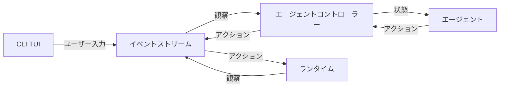
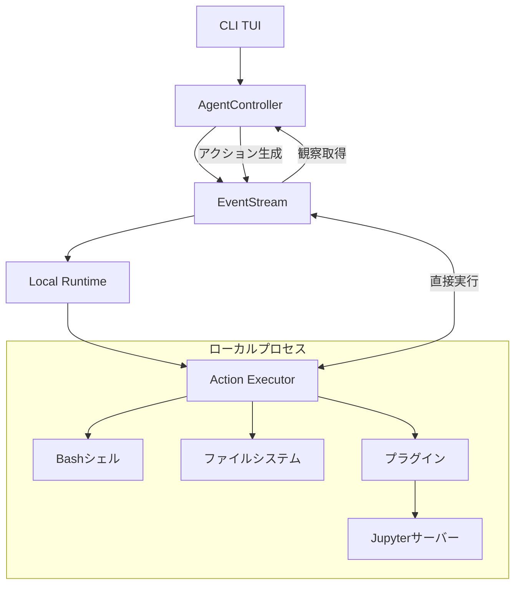

# OpenHands アーキテクチャ

# OpenHands CLI リファクタリングプロジェクト

## プロジェクト概要

OpenHands（旧OpenDevin）は、AI駆動のソフトウェア開発エージェントプラットフォームです。このプロジェクトは**サブスクリプション加入者向けの対話型CLIアプリケーション**として配布予定で、コマンドラインから直接AIエージェントと対話できます。


## 主要ディレクトリ

| ディレクトリ名 | 役割 | CLI関連性 |
|--------------|------|----------|
| `openhands/` | メインのPythonパッケージ。エージェント、コントローラー、CLI実装を含む | **最高** - CLI実装の中核 |
| `openhands/cli/` | **対話型CLIの実装**。main.py、commands.py、tui.pyを含む | **最高** - CLI機能の直接実装 |
| `docs/` | プロジェクトドキュメント | **中** - CLI使用方法を含む |
| `tests/` | テストスイート | **中** - CLI機能のテスト |

| `microagents/` | 特定タスク用のマイクロエージェント定義 | **高** - CLI経由で利用可能 |
| `dev_config/` | 開発環境設定 | **低** - 開発ツール設定 |

### openhands/ ディレクトリ詳細

| ディレクトリ名 | 役割 | CLI関連性 | 配布必要性 |
|--------------|------|----------|-----------|
| `openhands/cli/` | **対話型CLIの直接実装**。main.py、commands.py、tui.py、settings.py等 | **最高** - CLI機能の中核 | **必須** |
| `openhands/core/` | コア機能。設定、ログ、メッセージ処理、メインループ等 | **最高** - CLI動作の基盤 | **必須** |
| `openhands/controller/` | エージェント制御ロジック。agent_controller.py、action_parser.py等 | **最高** - エージェント実行制御 | **必須** |
| `openhands/events/` | イベントシステム。Action/Observation、EventStream等 | **最高** - エージェント通信の中核 | **必須** |
| `openhands/llm/` | 言語モデル統合。LLM接続、ストリーミング、メトリクス等 | **最高** - AI機能の中核 | **必須** |
| `openhands/memory/` | エージェントメモリ管理。会話履歴、コンテキスト管理等 | **最高** - 対話継続に必須 | **必須** |
| `openhands/microagent/` | 特化エージェント機能。プロンプト、タイプ定義等 | **高** - 専門タスク対応 | **必須** |
| `openhands/runtime/` | 実行環境。コマンド実行、ブラウザ操作、Docker等 | **最高** - アクション実行基盤 | **必須** |
| `openhands/agenthub/` | エージェント実装。codeact_agentのみ（dummy、readonly、loc削除済み） | **高** - メインエージェント | **必須** |
| `openhands/storage/` | データ永続化。会話保存、ファイル管理等 | **中** - データ保持機能 | **必須** |
| `openhands/security/` | セキュリティ機能。アクション解析、制限等 | **中** - 安全性確保 | **必須** |
| `openhands/io/` | 入出力処理。JSON、ファイルI/O等 | **中** - データ交換 | **必須** |
| `openhands/server/` | 型定義のみ（AppMode等）。Web機能は削除済み | **高** - 型定義として必要 | **最小化済み** |
| `openhands/integrations/` | 外部サービス連携。GitHub、GitLab、Bitbucket等 | **中** - 特定機能で使用 | **保持** |

| `openhands/utils/` | ユーティリティ関数 | **中** - 補助機能 | **保持** |
| `openhands/linter/` | コードリンティング・構文チェック機能 | **中** - 品質保証 | **保持** |
| `openhands/mcp/` | Model Context Protocol実装 | **低** - 特定プロトコル | **削除候補** |
| `openhands/__init__.py` | パッケージ初期化、バージョン管理 | **高** - パッケージ定義 | **必須** |
| `openhands/py.typed` | 型情報マーカー | **低** - 開発支援 | **保持** |
| `openhands/README.md` | アーキテクチャ説明 | **低** - ドキュメント | **削除候補** |


## ルート主要ファイル

| ファイル名 | 役割 | CLI関連性 | 配布必要性 |
|-----------|------|----------|-----------|
| `config.template.toml` | 設定テンプレート | **高** - CLI動作の設定を定義 | **必須** |
| `config.toml` | 実行設定ファイル | **高** - CLI実行時設定 | **必須** |
| `MANIFEST.in` | パッケージマニフェスト | **高** - CLI動作に必要なテンプレートファイル包含 | **必須** |
| `openhands2` | CLI実行スクリプト | **最高** - Python 3.12自動切り替え実装 | **必須** |
| `poetry.lock` | 依存関係ロック | **中** - CLI実行に必要な依存関係を固定 | **必須** |
| `pyproject.toml` | プロジェクト設定・ビルド設定 | **高** - CLIエントリーポイント、依存関係、Ruff設定 | **必須** |


### openhands/agenthub/ - エージェント実装 主要ファイル

| ファイル名 | 役割 | CLI関連性 | 配布必要性 |
|-----------|------|----------|-----------|
| `__init__.py` | メインモジュール初期化、CodeActAgentのインポート・公開 | **最高** - エージェントシステムのエントリーポイント | **必須** |
| `README.md` | エージェントアーキテクチャ、状態管理等のドキュメント | **低** - 実行時不要 | **削除候補** |
| `.DS_Store` | macOSシステムファイル | **低** - 不要ファイル | **削除候補** |
| `codeact_agent/__init__.py` | CodeActAgentのエージェントシステムへの登録 | **最高** - エージェント登録に必須 | **必須** |
| `codeact_agent/codeact_agent.py` | CodeActAgent実装本体 | **最高** - CLI動作の中核エージェント | **必須** |
| `codeact_agent/function_calling.py` | エージェントアクション（ファイル操作、コマンド等）の関数呼び出し実装 | **最高** - エージェント機能の中核 | **必須** |
| `codeact_agent/README.md` | CodeActAgentドキュメント | **低** - 実行時不要 | **削除候補** |
| `codeact_agent/.DS_Store` | macOSシステムファイル | **低** - 不要ファイル | **削除候補** |
| `codeact_agent/tools/__init__.py` | 全エージェントツール（bash、ipython、ファイル操作等）のエクスポート | **最高** - ツール統合に必須 | **必須** |
| `codeact_agent/tools/bash.py` | Bashコマンド実行ツール | **最高** - CLI操作の基本機能 | **必須** |
| `codeact_agent/tools/finish.py` | タスク完了通知ツール | **高** - エージェントタスク完了に必要 | **必須** |
| `codeact_agent/tools/ipython.py` | IPython/Jupyter実行ツール | **中** - データ分析タスク用 | **任意** |
| `codeact_agent/tools/llm_based_edit.py` | LLMベースファイル編集ツール | **高** - 高度な編集機能 | **必須** |
| `codeact_agent/tools/str_replace_editor.py` | 文字列置換ファイルエディタツール | **最高** - 基本的なファイル編集機能 | **必須** |
| `codeact_agent/tools/think.py` | 思考・推論ツール（複雑な問題解決用） | **中** - 透明性向上に有用 | **任意** |
| `codeact_agent/tools/.DS_Store` | macOSシステムファイル | **低** - 不要ファイル | **削除候補** |
| `codeact_agent/prompts/system_prompt.j2` | エージェント動作定義のシステムプロンプトテンプレート | **最高** - エージェント動作の中核定義 | **必須** |
| `codeact_agent/prompts/user_prompt.j2` | ユーザープロンプトテンプレート | **高** - ユーザーインタラクション形式 | **必須** |
| `codeact_agent/prompts/additional_info.j2` | 追加情報プロンプトテンプレート | **中** - 補助的プロンプト | **任意** |
| `codeact_agent/prompts/microagent_info.j2` | マイクロエージェント情報テンプレート | **低** - マルチエージェントシナリオ用 | **削除候補** |

### openhands/cli/ - 対話型CLI実装 主要ファイル

| ファイル名 | 役割 | CLI関連性 | 配布必要性 |
|-----------|------|----------|-----------|
| `main.py` | CLIメインエントリーポイント、セッション管理、メインループ実装 | **最高** - CLI動作の中核制御 | **必須** |
| `tui.py` | テキストユーザーインターフェース、表示制御、入力処理 | **最高** - CLI表示・操作の中核 | **必須** |
| `commands.py` | CLIコマンド処理、ヘルプ、設定、ステータス等のコマンド実装 | **最高** - CLI機能の直接実装 | **必須** |
| `settings.py` | CLI設定管理、LLM設定、プロバイダー設定等の対話的設定 | **最高** - CLI設定機能 | **必須** |
| `utils.py` | CLI用ユーティリティ関数、設定ファイル管理、メトリクス処理 | **高** - CLI補助機能 | **必須** |
| `suppress_warnings.py` | CLI実行時の警告抑制、ユーザー体験向上 | **中** - 品質向上 | **必須** |
| `.DS_Store` | macOSシステムファイル | **低** - 不要ファイル | **削除候補** |
| `__pycache__/` | Pythonバイトコードキャッシュディレクトリ | **低** - 実行時生成 | **削除候補** |

### openhands/controller/ - エージェント制御システム 主要ファイル

| ファイル名 | 役割 | CLI関連性 | 配布必要性 |
|-----------|------|----------|-----------|
| `__init__.py` | モジュール初期化、AgentControllerのエクスポート | **最高** - コントローラーシステムのエントリーポイント | **必須** |
| `agent_controller.py` | エージェント制御の中核実装、メインループ、状態管理、例外処理（1291行） | **最高** - CLI動作の制御中枢 | **必須** |
| `agent.py` | エージェント抽象基底クラス、エージェント登録・管理システム | **最高** - エージェントシステムの基盤 | **必須** |
| `action_parser.py` | LLMレスポンスからアクションへの解析、パーサー抽象化 | **最高** - LLM応答処理の中核 | **必須** |
| `stuck.py` | エージェントのループ検出、スタック状態の判定・回復機能 | **高** - エージェント安定性確保 | **必須** |
| `state/state.py` | エージェント状態管理、セッション永続化、状態遷移制御 | **最高** - 状態管理の中核 | **必須** |
| `state/state_tracker.py` | 状態追跡・同期、メトリクス管理、イベントフィルタリング | **最高** - 状態同期システム | **必須** |
| `state/control_flags.py` | 制御フラグ管理、予算・反復制限、実行制御 | **高** - 実行制限・制御機能 | **必須** |
| `__pycache__/` | Pythonバイトコードキャッシュディレクトリ | **低** - 実行時生成 | **削除候補** |

### openhands/core/ - コア機能システム 主要ファイル

| ファイル名 | 役割 | CLI関連性 | 配布必要性 |
|-----------|------|----------|-----------|
| `main.py` | コアメインエントリーポイント、コントローラー実行、設定統合（273行） | **最高** - CLI動作の中核制御 | **必須** |
| `setup.py` | ランタイム・エージェント・メモリ作成、セッション初期化（229行） | **最高** - CLI起動時の初期化処理 | **必須** |
| `loop.py` | エージェント実行ループ、終了状態管理、ステータスコールバック（44行） | **最高** - エージェント実行制御 | **必須** |
| `logger.py` | ログシステム、構造化ログ、LLMデバッグ、JSON出力（499行） | **最高** - CLI動作の監視・デバッグ | **必須** |
| `exceptions.py` | 例外クラス定義、エラーハンドリング、エージェント例外（226行） | **最高** - エラー処理の基盤 | **必須** |
| `message.py` | メッセージ形式定義、LLM通信、コンテンツタイプ（158行） | **最高** - LLM通信の中核 | **必須** |
| `message_utils.py` | メッセージユーティリティ、変換・処理関数（52行） | **高** - メッセージ処理補助 | **必須** |
| `download.py` | ダウンロード機能（2行） | **低** - 最小限の機能 | **保持** |
| `message_format.md` | メッセージ形式ドキュメント | **低** - 実行時不要 | **削除候補** |
| `config/__init__.py` | 設定モジュール初期化、全設定クラスのエクスポート（45行） | **最高** - 設定システムのエントリーポイント | **必須** |
| `config/openhands_config.py` | メイン設定クラス、全体設定統合（160行） | **最高** - CLI設定の中核 | **必須** |
| `config/llm_config.py` | LLM設定、プロバイダー設定、API設定（171行） | **最高** - LLM接続設定 | **必須** |
| `config/agent_config.py` | エージェント設定、動作パラメータ（129行） | **最高** - エージェント動作設定 | **必須** |
| `config/sandbox_config.py` | サンドボックス設定、実行環境設定（117行） | **最高** - 実行環境設定 | **必須** |
| `config/utils.py` | 設定ユーティリティ、引数解析、設定読み込み（853行） | **最高** - 設定処理の中核 | **必須** |
| `config/condenser_config.py` | メモリ圧縮設定、履歴管理設定（300行） | **高** - メモリ管理設定 | **必須** |
| `config/mcp_config.py` | Model Context Protocol設定（211行） | **中** - 特定プロトコル設定 | **保持** |
| `config/kubernetes_config.py` | Kubernetes設定、クラスター実行設定（85行） | **低** - 特定環境設定 | **削除候補** |
| `config/config_utils.py` | 設定ユーティリティ関数、デフォルト値（62行） | **高** - 設定補助機能 | **必須** |
| `config/extended_config.py` | 拡張設定、追加パラメータ（41行） | **中** - 拡張機能設定 | **保持** |
| `config/security_config.py` | セキュリティ設定、制限設定（35行） | **中** - セキュリティ機能 | **必須** |
| `config/README.md` | 設定ドキュメント | **低** - 実行時不要 | **削除候補** |
| `schema/__init__.py` | スキーマモジュール初期化、型定義エクスポート（9行） | **最高** - 型システムのエントリーポイント | **必須** |
| `schema/action.py` | アクション型定義、ActionType列挙（93行） | **最高** - アクション型システム | **必須** |
| `schema/agent.py` | エージェント型定義、AgentState列挙（51行） | **最高** - エージェント状態型 | **必須** |
| `schema/observation.py` | 観察型定義、ObservationType列挙（54行） | **最高** - 観察型システム | **必須** |
| `const/guide_url.py` | ガイドURL定数（1行） | **低** - 定数定義 | **保持** |
| `__pycache__/` | Pythonバイトコードキャッシュディレクトリ | **低** - 実行時生成 | **削除候補** |

### openhands/events/ - イベントシステム 主要ファイル

| ファイル名 | 役割 | CLI関連性 | 配布必要性 |
|-----------|------|----------|-----------|
| `__init__.py` | イベントモジュール初期化、Event・EventStreamのエクスポート（10行） | **最高** - イベントシステムのエントリーポイント | **必須** |
| `stream.py` | イベントストリーム、購読者管理、非同期処理（276行） | **最高** - CLI通信の中核システム | **必須** |
| `event.py` | イベント基底クラス、EventSource・RecallType定義（139行） | **最高** - イベント型システムの基盤 | **必須** |
| `event_store.py` | イベント保存・取得、永続化機能（171行） | **最高** - セッション履歴管理 | **必須** |
| `event_filter.py` | イベントフィルタリング、条件付き処理（98行） | **高** - イベント処理最適化 | **必須** |
| `nested_event_store.py` | ネストイベント保存、階層管理（79行） | **高** - 複雑なイベント構造管理 | **必須** |
| `utils.py` | イベントユーティリティ関数（61行） | **高** - イベント処理補助 | **必須** |
| `async_event_store_wrapper.py` | 非同期イベント保存ラッパー（24行） | **高** - 非同期処理対応 | **必須** |
| `event_store_abc.py` | イベント保存抽象基底クラス（111行） | **高** - イベント保存インターフェース | **必須** |
| `tool.py` | ツール呼び出しメタデータ（11行） | **中** - ツール統合機能 | **必須** |
| `action/__init__.py` | アクションモジュール初期化、全アクションクラスのエクスポート（38行） | **最高** - アクションシステムのエントリーポイント | **必須** |
| `action/action.py` | アクション基底クラス、確認状態・セキュリティリスク定義（23行） | **最高** - アクション型システムの基盤 | **必須** |
| `action/commands.py` | コマンド実行アクション、CmdRun・IPythonRunCell（62行） | **最高** - CLI基本機能の中核 | **必須** |
| `action/files.py` | ファイル操作アクション、Read・Write・Edit（138行） | **最高** - ファイル操作の中核 | **必須** |
| `action/agent.py` | エージェントアクション、Finish・Reject・Think・Delegate（197行） | **最高** - エージェント制御の中核 | **必須** |
| `action/message.py` | メッセージアクション、ユーザー・システムメッセージ（66行） | **最高** - 対話機能の中核 | **必須** |
| `action/mcp.py` | Model Context Protocolアクション（32行） | **中** - 特定プロトコル機能 | **保持** |
| `action/empty.py` | 空アクション、NullAction定義（15行） | **高** - システム制御用 | **必須** |
| `observation/__init__.py` | 観察モジュール初期化、全観察クラスのエクスポート（49行） | **最高** - 観察システムのエントリーポイント | **必須** |
| `observation/observation.py` | 観察基底クラス（8行） | **最高** - 観察型システムの基盤 | **必須** |
| `observation/commands.py` | コマンド出力観察、メタデータ・実行結果（191行） | **最高** - コマンド実行結果処理 | **必須** |
| `observation/files.py` | ファイル操作観察、読み取り・書き込み結果（195行） | **最高** - ファイル操作結果処理 | **必須** |
| `observation/agent.py` | エージェント観察、状態変化・思考・圧縮（136行） | **最高** - エージェント状態監視 | **必須** |
| `observation/browse.py` | ブラウザ出力観察、Web操作結果（55行） | **中** - ブラウザ機能用 | **保持** |
| `observation/error.py` | エラー観察、例外・エラー情報（23行） | **最高** - エラー処理の中核 | **必須** |
| `observation/delegate.py` | 委任観察、エージェント委任結果（22行） | **中** - マルチエージェント機能 | **保持** |
| `observation/success.py` | 成功観察、正常完了通知（15行） | **高** - 成功状態管理 | **必須** |
| `observation/reject.py` | 拒否観察、ユーザー拒否通知（15行） | **高** - ユーザー制御機能 | **必須** |
| `observation/empty.py` | 空観察、Null観察定義（17行） | **高** - システム制御用 | **必須** |
| `observation/mcp.py` | Model Context Protocol観察（20行） | **中** - 特定プロトコル機能 | **保持** |
| `serialization/__init__.py` | シリアライゼーションモジュール初期化（19行） | **最高** - データ変換システムのエントリーポイント | **必須** |
| `serialization/event.py` | イベントシリアライゼーション、辞書変換・軌跡生成（170行） | **最高** - イベントデータ変換の中核 | **必須** |
| `serialization/action.py` | アクションシリアライゼーション、辞書からアクション生成（136行） | **最高** - アクションデータ変換 | **必須** |
| `serialization/observation.py` | 観察シリアライゼーション、辞書から観察生成（136行） | **最高** - 観察データ変換 | **必須** |
| `serialization/utils.py` | シリアライゼーションユーティリティ（20行） | **高** - データ変換補助 | **必須** |
| `__pycache__/` | Pythonバイトコードキャッシュディレクトリ | **低** - 実行時生成 | **削除候補** |

### openhands/integrations/ - 外部サービス統合 主要ファイル

| ファイル名 | 役割 | CLI関連性 | 配布必要性 |
|-----------|------|----------|-----------|
| `provider.py` | 統合プロバイダー管理、GitHub・GitLab・Bitbucket統合（380行） | **中** - Git統合機能 | **保持** |
| `service_types.py` | サービス型定義、プロバイダー・タスク・認証型（235行） | **中** - 統合サービス基盤 | **保持** |
| `utils.py` | 統合ユーティリティ関数（61行） | **中** - 統合機能補助 | **保持** |
| `github/github_service.py` | GitHub API統合サービス（513行） | **低** - GitHub特化機能 | **削除候補** |
| `github/queries.py` | GitHub GraphQLクエリ定義（47行） | **低** - GitHub特化機能 | **削除候補** |
| `gitlab/gitlab_service.py` | GitLab API統合サービス（502行） | **低** - GitLab特化機能 | **削除候補** |
| `bitbucket/bitbucket_service.py` | Bitbucket API統合サービス（302行） | **低** - Bitbucket特化機能 | **削除候補** |
| `bitbucket/__init__.py` | Bitbucketモジュール初期化（0行） | **低** - 空ファイル | **削除候補** |
| `templates/` | 統合テンプレートディレクトリ | **低** - テンプレート機能 | **削除候補** |
| `__pycache__/` | Pythonバイトコードキャッシュディレクトリ | **低** - 実行時生成 | **削除候補** |

### openhands/io/ - 入出力システム 主要ファイル

| ファイル名 | 役割 | CLI関連性 | 配布必要性 |
|-----------|------|----------|-----------|
| `__init__.py` | IOモジュール初期化、json・IOのエクスポート（10行） | **最高** - IOシステムのエントリーポイント | **必須** |
| `json.py` | JSON処理、カスタムエンコーダー・デコーダー（74行） | **最高** - データシリアライゼーション | **必須** |
| `io.py` | 基本IO操作、ファイル・ストリーム処理（37行） | **最高** - ファイル操作基盤 | **必須** |
| `__pycache__/` | Pythonバイトコードキャッシュディレクトリ | **低** - 実行時生成 | **削除候補** |

### openhands/linter/ - コードリンター 主要ファイル

| ファイル名 | 役割 | CLI関連性 | 配布必要性 |
|-----------|------|----------|-----------|
| `__init__.py` | リンターモジュール初期化、基本リンター機能（11行） | **低** - コード品質機能 | **削除候補** |

### openhands/llm/ - 言語モデル統合 主要ファイル

| ファイル名 | 役割 | CLI関連性 | 配布必要性 |
|-----------|------|----------|-----------|
| `__init__.py` | LLMモジュール初期化（5行） | **最高** - LLMシステムのエントリーポイント | **必須** |
| `llm.py` | LLM基底クラス、プロバイダー統合、API呼び出し（803行） | **最高** - LLM機能の中核 | **必須** |
| `fn_call_converter.py` | 関数呼び出し変換、ツール統合（956行） | **最高** - ツール呼び出しシステム | **必須** |
| `metrics.py` | LLMメトリクス、使用量・コスト追跡（277行） | **高** - 使用量監視機能 | **必須** |
| `async_llm.py` | 非同期LLM処理、並行実行（130行） | **高** - 非同期処理対応 | **必須** |
| `streaming_llm.py` | ストリーミングLLM、リアルタイム応答（113行） | **高** - ストリーミング機能 | **必須** |
| `retry_mixin.py` | リトライ機能、エラー処理（76行） | **高** - 信頼性向上機能 | **必須** |
| `debug_mixin.py` | デバッグ機能、ログ出力（53行） | **中** - デバッグ支援 | **保持** |
| `llm_utils.py` | LLMユーティリティ関数（44行） | **高** - LLM処理補助 | **必須** |
| `bedrock.py` | AWS Bedrock統合（32行） | **低** - 特定プロバイダー機能 | **削除候補** |
| `tool_names.py` | ツール名定数（7行） | **高** - ツール識別機能 | **必須** |
| `__pycache__/` | Pythonバイトコードキャッシュディレクトリ | **低** - 実行時生成 | **削除候補** |

### openhands/mcp/ - Model Context Protocol 主要ファイル

| ファイル名 | 役割 | CLI関連性 | 配布必要性 |
|-----------|------|----------|-----------|
| `__init__.py` | MCPモジュール初期化、クライアント・ツールのエクスポート（19行） | **中** - MCPシステムのエントリーポイント | **保持** |
| `utils.py` | MCPユーティリティ、設定・接続管理（228行） | **中** - MCP機能補助 | **保持** |
| `client.py` | MCPクライアント、プロトコル実装（108行） | **中** - MCP通信機能 | **保持** |
| `tool.py` | MCPツール定義（23行） | **中** - MCPツール統合 | **保持** |
| `__pycache__/` | Pythonバイトコードキャッシュディレクトリ | **低** - 実行時生成 | **削除候補** |

### openhands/memory/ - メモリ管理システム 主要ファイル

| ファイル名 | 役割 | CLI関連性 | 配布必要性 |
|-----------|------|----------|-----------|
| `__init__.py` | メモリモジュール初期化（0行） | **高** - メモリシステムのエントリーポイント | **必須** |
| `conversation_memory.py` | 会話メモリ管理、履歴保存・検索（820行） | **最高** - 会話履歴管理の中核 | **必須** |
| `memory.py` | メモリ基底クラス、抽象インターフェース（345行） | **最高** - メモリシステムの基盤 | **必須** |
| `condenser/condenser.py` | メモリ圧縮基底クラス（170行） | **高** - メモリ最適化機能 | **必須** |
| `condenser/__init__.py` | 圧縮モジュール初期化（15行） | **高** - 圧縮システムのエントリーポイント | **必須** |
| `condenser/impl/structured_summary_condenser.py` | 構造化要約圧縮（328行） | **中** - 高度な圧縮機能 | **保持** |
| `condenser/impl/llm_summarizing_condenser.py` | LLM要約圧縮（173行） | **中** - LLM活用圧縮 | **保持** |
| `condenser/impl/llm_attention_condenser.py` | LLM注意機構圧縮（130行） | **中** - 高度な圧縮機能 | **保持** |
| `view.py` | メモリビュー、表示機能（77行） | **中** - メモリ可視化 | **保持** |
| `condenser/impl/` | その他圧縮実装（7ファイル、計約400行） | **中** - 圧縮アルゴリズム | **保持** |
| `__pycache__/` | Pythonバイトコードキャッシュディレクトリ | **低** - 実行時生成 | **削除候補** |

### openhands/runtime/ - ランタイム実行環境 主要ファイル

| ファイル名 | 役割 | CLI関連性 | 配布必要性 |
|-----------|------|----------|-----------|
| `__init__.py` | ランタイムモジュール初期化（34行） | **最高** - ランタイムシステムのエントリーポイント | **必須** |
| `utils/windows_bash.py` | Windows Bash統合（1417行） | **中** - Windows対応 | **保持** |
| `action_execution_server.py` | アクション実行サーバー（1008行） | **最高** - アクション実行の中核 | **必須** |
| `base.py` | ランタイム基底クラス（965行） | **最高** - ランタイムシステムの基盤 | **必須** |
| `impl/cli/cli_runtime.py` | CLIランタイム実装（867行） | **最高** - CLI実行環境の中核 | **必須** |
| `utils/bash.py` | Bash実行ユーティリティ（656行） | **最高** - コマンド実行機能 | **必須** |
| `impl/local/local_runtime.py` | ローカルランタイム実装（566行） | **高** - ローカル実行環境 | **必須** |
| `impl/action_execution/action_execution_client.py` | アクション実行クライアント（474行） | **最高** - アクション実行通信 | **必須** |
| `utils/runtime_build.py` | ランタイム構築ユーティリティ（449行） | **高** - 環境構築機能 | **必須** |
| `plugins/agent_skills/file_ops/file_ops.py` | ファイル操作プラグイン（403行） | **高** - ファイル操作機能 | **必須** |
| `utils/edit.py` | 編集ユーティリティ（347行） | **高** - ファイル編集機能 | **必須** |
| `plugins/jupyter/execute_server.py` | Jupyter実行サーバー（309行） | **中** - Jupyter統合 | **保持** |
| `plugins/agent_skills/file_reader/file_readers.py` | ファイル読み取りプラグイン（245行） | **高** - ファイル読み取り機能 | **必須** |
| `utils/git_handler.py` | Git操作ハンドラー（223行） | **中** - Git統合機能 | **保持** |
| `plugins/jupyter/__init__.py` | Jupyterプラグイン初期化（172行） | **中** - Jupyter統合 | **保持** |
| `utils/files.py` | ファイルユーティリティ（150行） | **高** - ファイル操作補助 | **必須** |
| `utils/file_viewer.py` | ファイルビューアー（143行） | **中** - ファイル表示機能 | **保持** |
| `mcp/proxy/manager.py` | MCPプロキシマネージャー（125行） | **中** - MCP統合機能 | **保持** |
| `utils/runtime_init.py` | ランタイム初期化（120行） | **高** - 環境初期化機能 | **必須** |
| `plugins/vscode/__init__.py` | VSCodeプラグイン（120行） | **低** - VSCode統合 | **削除候補** |
| `file_viewer_server.py` | ファイルビューアーサーバー（112行） | **中** - ファイル表示サーバー | **保持** |
| その他ユーティリティ | システム統計・ログ・コマンド処理（約500行） | **中** - 補助機能 | **保持** |
| `plugins/` | エージェントスキル・要件管理（約200行） | **高** - プラグインシステム | **必須** |

### openhands/security/ - セキュリティシステム 主要ファイル

| ファイル名 | 役割 | CLI関連性 | 配布必要性 |
|-----------|------|----------|-----------|
| `__init__.py` | セキュリティモジュール初期化（7行） | **中** - セキュリティシステムのエントリーポイント | **保持** |
| `invariant/analyzer.py` | 不変条件分析器（365行） | **中** - セキュリティ分析機能 | **保持** |
| `invariant/client.py` | 不変条件クライアント（140行） | **中** - セキュリティ検証機能 | **保持** |
| `invariant/parser.py` | 不変条件パーサー（102行） | **中** - セキュリティルール解析 | **保持** |
| `analyzer.py` | セキュリティ分析器（67行） | **中** - セキュリティ検証機能 | **保持** |
| `invariant/nodes.py` | 不変条件ノード定義（49行） | **中** - セキュリティルール構造 | **保持** |
| `invariant/policies.py` | セキュリティポリシー（19行） | **中** - セキュリティ設定 | **保持** |
| `options.py` | セキュリティオプション（6行） | **中** - セキュリティ設定 | **保持** |
| `invariant/__init__.py` | 不変条件モジュール初期化（5行） | **中** - セキュリティサブシステム | **保持** |

### openhands/storage/ - データ永続化システム 主要ファイル

| ファイル名 | 役割 | CLI関連性 | 配布必要性 |
|-----------|------|----------|-----------|
| `s3.py` | Amazon S3ストレージ統合（165行） | **低** - クラウドストレージ機能 | **削除候補** |
| `data_models/user_secrets.py` | ユーザー秘密情報データモデル（163行） | **中** - 認証情報管理 | **保持** |
| `data_models/settings.py` | 設定データモデル（134行） | **高** - CLI設定データ構造 | **必須** |
| `conversation/file_conversation_store.py` | ファイルベース会話ストレージ（121行） | **最高** - 会話履歴保存 | **必須** |
| `web_hook.py` | Webフック機能（118行） | **低** - Web統合機能 | **削除候補** |
| `google_cloud.py` | Google Cloudストレージ統合（80行） | **低** - クラウドストレージ機能 | **削除候補** |
| `conversation/conversation_store.py` | 会話ストレージ抽象基底クラス（71行） | **最高** - 会話保存インターフェース | **必須** |
| `local.py` | ローカルストレージ実装（53行） | **最高** - ローカルファイル保存 | **必須** |
| `memory.py` | メモリストレージ実装（51行） | **高** - 一時的データ保存 | **必須** |
| `secrets/file_secrets_store.py` | ファイルベース秘密情報ストレージ（48行） | **中** - 認証情報保存 | **保持** |
| `__init__.py` | ストレージモジュール初期化（43行） | **最高** - ストレージシステムのエントリーポイント | **必須** |
| `settings/file_settings_store.py` | ファイルベース設定ストレージ（42行） | **高** - CLI設定保存 | **必須** |
| `conversation/conversation_validator.py` | 会話データ検証（37行） | **高** - データ整合性確保 | **必須** |
| `settings/settings_store.py` | 設定ストレージ抽象基底クラス（36行） | **高** - 設定保存インターフェース | **必須** |
| `secrets/secrets_store.py` | 秘密情報ストレージ抽象基底クラス（36行） | **中** - 認証情報保存インターフェース | **保持** |
| `data_models/conversation_metadata.py` | 会話メタデータモデル（33行） | **高** - 会話情報管理 | **必須** |
| `locations.py` | ストレージ場所管理（30行） | **高** - ファイルパス管理 | **必須** |
| `files.py` | ファイルストレージユーティリティ（19行） | **高** - ファイル操作補助 | **必須** |
| `data_models/conversation_metadata_result_set.py` | 会話メタデータ結果セット（9行） | **中** - 検索結果管理 | **保持** |
| `data_models/conversation_status.py` | 会話ステータス定義（7行） | **高** - 会話状態管理 | **必須** |

### openhands/utils/ - ユーティリティシステム 主要ファイル

| ファイル名 | 役割 | CLI関連性 | 配布必要性 |
|-----------|------|----------|-----------|
| `prompt.py` | プロンプト処理ユーティリティ（148行） | **高** - プロンプト生成・処理 | **必須** |
| `conversation_summary.py` | 会話要約機能（136行） | **高** - 会話履歴要約 | **必須** |
| `chunk_localizer.py` | チャンクローカライザー（101行） | **中** - データ分割・位置特定 | **保持** |
| `async_utils.py` | 非同期処理ユーティリティ（97行） | **高** - 非同期処理補助 | **必須** |
| `shutdown_listener.py` | シャットダウンリスナー（93行） | **高** - 終了処理管理 | **必須** |
| `ensure_httpx_close.py` | HTTP接続クローズ確保（76行） | **中** - HTTP接続管理 | **保持** |
| `import_utils.py` | インポートユーティリティ（69行） | **高** - 動的インポート機能 | **必須** |
| `http_session.py` | HTTPセッション管理（62行） | **中** - HTTP通信管理 | **保持** |
| `llm.py` | LLMユーティリティ（56行） | **高** - LLM処理補助 | **必須** |
| `search_utils.py` | 検索ユーティリティ（29行） | **中** - 検索機能補助 | **保持** |
| `term_color.py` | ターミナル色彩制御（25行） | **高** - CLI表示制御 | **必須** |
| `tenacity_stop.py` | リトライ停止条件（11行） | **中** - エラー処理補助 | **保持** |


### 現在の課題

**配布関係の複雑性**: 元々オープンソースプロジェクトとして設計されているため、配布用にカスタマイズしようとすると以下の問題が発生：

- 不要な関連ファイルが多数存在
- 開発用設定とプロダクション用設定が混在
- 依存関係が複雑で配布パッケージが肥大化
- ドキュメントや設定ファイルが散在してカスタマイズが困難

### 解決アプローチ

**段階的リファクタリング**: まず構成を綺麗に整理してからカスタマイズ・配布を行う：

1. **Phase 1: クリーンアップ** - 不要ファイル削除、構成整理
2. **Phase 2: カスタマイズ** - サブスク向け機能追加・調整  
3. **Phase 3: 配布準備** - 難読化、パッケージング、配布設定

### **Phase 1: クリーンアップ（現在実施中）**
1. **不要ファイル削除**: オープンソース関連ファイル（README、LICENSE、CONTRIBUTING等）の除去
2. **構成整理**: 開発用設定と配布用設定の分離・整理
3. **依存関係最適化**: 不要な依存関係の削除、配布パッケージの軽量化
4. **CLI特化**: 対話型CLI機能に特化したシンプルな構成

#### **リファクタリング手順**

**実行済み手順** (参照: 実際のコミット履歴)
1. **構造調査**: `find`、`grep`でディレクトリ構成・依存関係分析
2. **影響範囲確認**: CLI機能への影響をテストで確認
3. **段階的削除**: frontend/ → server/ の順で削除実行
4. **型定義保持**: 必要最小限の型定義（AppMode等）のみ残す
5. **動作確認**: 各段階でCLI機能の動作確認
6. **品質チェック**: ruff、mypy による品質確認
7. **変更コミット**: 段階的にコミット・プッシュ

**使用したコマンド例**
```bash
# 構造調査
find openhands/server/ -name "*.py" | wc -l
find openhands/server/ -name "*.py" -exec wc -l {} + | tail -1

# 依存関係調査  
grep -r "from openhands\.server\|import.*openhands\.server" . --include="*.py"

# 段階的削除
find openhands/server/ -name "*.py" ! -name "types.py" ! -name "__init__.py" -delete

# 動作確認
poetry run openhands --help
poetry run ruff check openhands/
```

## リファクタリング方法

### **原則: ミニマリスト**
**徹底的に不要な情報を削ぎ落とす** - CLI配布に必要最小限の構成のみ残す

### **Step 1: ユーザー理解の促進**
指定されたディレクトリにあるファイル一覧を調査し、以下の観点でドキュメント化：

```bash
# ディレクトリ内ファイル調査
ls -la target_directory/
# 各ファイルの役割確認
cat filename
# CLI関連性の判定
grep -r "filename" openhands/cli/
```

**ドキュメント更新内容:**
- ファイル名と役割
- CLI関連性（高/中/低/無関係）
- 配布必要性（必須/保持/削除候補）
- 簡潔な説明

### **Step 2: ユーザーとの対話**
ユーザーからの質問に答えてユーザー理解を促進：

- **ファイルの役割説明**: 「このファイルは何をするものですか？」
- **削除影響の説明**: 「削除するとどうなりますか？」
- **代替手段の提案**: 「他の方法はありますか？」
- **削除判定の支援**: 不要と判断すれば削除実行

```bash
# 実験的削除・検証
mv filename filename.backup
poetry build && openhands --help
# 問題なければ削除確定
rm filename.backup
```

### **Step 3: ドキュメント同期**
削除したファイルの情報をドキュメントからも削除：

- 該当ファイルの記載を表から除去
- 関連する説明文を削除
- ファイル数やディレクトリ構成を更新
- 参考情報の更新

### **判定基準**
- **削除対象**: README、LICENSE、CONTRIBUTING、開発用設定等
- **保持対象**: CLI動作、ビルド、テンプレート、設定ファイル
- **要検証**: 依存関係があるが用途不明なファイル

### **複数エージェント対応**
- 同じ手順で一貫した判定
- ドキュメント更新の標準化
- ミニマリスト原則の徹底


## 対話型CLI機能

このプロジェクトの**主要な特徴は対話型CLIアプリケーション**であることです：

### CLIエントリーポイント
- `openhands` - メインCLIコマンド

### CLI実装場所
- `openhands/cli/main.py` - CLIのメインエントリーポイント
- `openhands/cli/tui.py` - テキストユーザーインターフェース
- `openhands/cli/commands.py` - CLIコマンド処理
- `openhands/cli/settings.py` - CLI設定管理

### 対話機能
- プロンプトベースの対話
- リアルタイムエージェント実行状況表示
- ストリーミング出力
- 使用量メトリクス表示

## 配布方法

### 難読化配布
- Claude Codeスタイルの難読化を実施
- ソースコードの可読性を意図的に低下
- サブスクリプション加入者向けの商用配布

### パッケージング
- PyInstaller等での実行ファイル化
- 依存関係の同梱
- クロスプラットフォーム対応

## 参考情報

このドキュメントは以下のソースファイルを基に作成・更新されました：
- `pyproject.toml` - プロジェクト設定とCLIエントリーポイント定義
- `openhands/cli/main.py` - CLI実装の確認
- `MANIFEST.in` - パッケージング設定の確認
- `pytest.ini` - テスト設定の確認
- `openhands/__init__.py` - パッケージ初期化とバージョン管理の確認
- `openhands/README.md` - OpenHandsアーキテクチャ概要の確認
- `openhands/` ディレクトリ構造の直接調査（find、ls コマンド使用）
- 各サブディレクトリの役割分析（CLI関連性の判定）
- プロジェクトディレクトリ構造の直接調査
- 2024年12月7日 - サブスク加入者向け配布最適化対応
- 2025年7月4日 - openhands/ディレクトリ詳細分析追加
- 2025年7月5日 - openhands/linter/詳細分析・保持決定
- 2025年7月5日 - openhands/controller/詳細分析・エージェント制御システム構成追加
- 2025年7月5日 - openhands/core/詳細分析・コア機能システム構成追加
- 2025年7月5日 - openhands/events/詳細分析・イベントシステム構成追加
- 2025年7月5日 - openhands/integrations/詳細分析・外部サービス統合構成追加
- 2025年7月5日 - openhands/io/詳細分析・入出力システム構成追加
- 2025年7月5日 - openhands/linter/詳細分析・コードリンター構成追加
- 2025年7月5日 - openhands/llm/詳細分析・言語モデル統合構成追加
- 2025年7月5日 - openhands/mcp/詳細分析・Model Context Protocol構成追加
- 2025年7月5日 - openhands/memory/詳細分析・メモリ管理システム構成追加
- 2025年7月5日 - openhands/runtime/詳細分析・ランタイム実行環境構成追加
- 2025年7月5日 - openhands/security/詳細分析・セキュリティシステム構成追加
- 2025年7月5日 - openhands/storage/詳細分析・データ永続化システム構成追加
- 2025年7月5日 - openhands/utils/詳細分析・ユーティリティシステム構成追加

## 重要コンポーネント詳細

## クラス

OpenHandsの主要なクラスは以下の通りです：

| クラス名 | 役割 | 詳細 |
|---------|------|------|
| **LLM** | 大規模言語モデルとの相互作用を仲介 | LiteLLMのおかげで、あらゆる基盤となる補完モデルと連携可能 |
| **Agent** | 現在の状態を確認し、アクションを生成 | 最終目標に一歩近づくアクションを生成する責任 |
| **AgentController** | エージェントの制御とメインループ | エージェントを初期化し、状態を管理し、段階的に前進させる |
| **State** | エージェントのタスクの現在状態 | 現在のステップ、最近のイベント履歴、長期計画などを含む |
| **EventStream** | イベントの中央ハブ | 任意のコンポーネントがイベントを公開・監視可能 |
| **Runtime** | アクションの実行と観察の送信 | アクションを実行し、観察を送り返す責任 |
| **Server** | HTTP経由でのセッション仲介 | フロントエンドを駆動するためのHTTP仲介 |

### イベントシステム

| 要素 | 種類 | 説明 |
|------|------|------|
| **Event** | 基底クラス | アクションまたは観察の基底 |
| **Action** | イベント | ファイル編集、コマンド実行、メッセージ送信などのリクエスト |
| **Observation** | イベント | 環境から収集された情報（ファイル内容、コマンド出力など） |

### ランタイムコンポーネント

| コンポーネント | 役割 | 詳細 |
|---------------|------|------|
| **Sandbox** | コマンド実行環境 | Docker内でのコマンド実行など |
| **Session** | セッション管理 | 単一のEventStream、AgentController、Runtimeを保持 |
| **ConversationManager** | 会話管理 | アクティブセッションのリスト保持とルーティング |

## 制御フロー

エージェントを駆動する基本的なループ（疑似コード）：

```python
while True:
  prompt = agent.generate_prompt(state)
  response = llm.completion(prompt)
  action = agent.parse_response(response)
  observation = runtime.run(action)
  state = state.update(action, observation)
```

実際には、これらの大部分はEventStreamを介したメッセージパッシングによって実現されます。
EventStreamは、OpenHandsにおけるすべての通信のバックボーンとして機能します。



## ランタイムアーキテクチャ

OpenHands CLI Runtimeは、AIエージェントのアクションをローカル環境で実行するコアコンポーネントです。
ローカルランタイムを使用して、ユーザーのローカルマシン上で直接コードを実行し、対話型のAI開発体験を提供します。

### CLI専用ローカルランタイムの特徴

OpenHands CLIがローカル実行環境を採用する理由：

| 特徴 | 説明 |
|------|------|
| **直接実行** | ユーザーのローカル環境で直接コードを実行し、即座にフィードバックを提供 |
| **高速性** | コンテナ化のオーバーヘッドがなく、ネイティブ速度でコード実行 |
| **シンプル性** | Docker等の追加インフラが不要で、インストールと使用が簡単 |
| **統合性** | ローカルファイルシステム、環境変数、開発ツールとの自然な統合 |
| **対話性** | リアルタイムでの入出力とユーザーとの対話が可能 |

### ランタイムの動作原理

OpenHands CLI Runtimeシステムは、ローカルプロセスベースのアーキテクチャを使用します。動作概要：



#### 実行フロー

| ステップ | 説明 |
|---------|------|
| **1. CLI起動** | ユーザーが`openhands`コマンドでCLIを起動 |
| **2. ランタイム初期化** | ローカルランタイムが初期化され、必要なコンポーネントを設定 |
| **3. エージェント開始** | AgentControllerがエージェントを初期化し、EventStreamを作成 |
| **4. アクション実行** | エージェントが生成したアクションをローカル環境で直接実行 |
| **5. 観察収集** | 実行結果を観察として収集し、エージェントにフィードバック |
| **6. 対話継続** | ユーザーとエージェントの対話を継続的に処理 |

#### ローカルランタイムの役割

| 機能 | 説明 |
|------|------|
| **直接実行** | シェルコマンド、ファイル操作、Pythonコードをローカル環境で直接実行 |
| **状態管理** | 現在の作業ディレクトリや環境変数を含む、実行環境の状態を管理 |
| **プラグイン統合** | Jupyter、ブラウザ等のプラグインをローカルプロセスとして起動・管理 |
| **リアルタイム通信** | エージェントとの間でリアルタイムでアクションと観察を交換 |


### ランタイムプラグインシステム

OpenHands CLI Runtimeは、機能拡張とローカル実行環境のカスタマイズを可能にするプラグインシステムをサポートしています。プラグインは、ローカルランタイムの起動時に初期化されます。

独自のプラグインを実装したい場合は、[Jupyterプラグインの例](https://github.com/All-Hands-AI/OpenHands/blob/ecf4aed28b0cf7c18d4d8ff554883ba182fc6bdd/openhands/runtime/plugins/jupyter/__init__.py#L21-L55)をご確認ください。

*プラグインシステムの詳細はまだ構築中です - 貢献を歓迎します！*

#### プラグインシステムの主要側面

| 側面 | 説明 |
|------|------|
| **プラグイン定義** | プラグインは、ベース`Plugin`クラスを継承するPythonクラスとして定義 |
| **プラグイン登録** | 利用可能なプラグインは`ALL_PLUGINS`辞書に登録 |
| **プラグイン指定** | プラグインは`Agent.sandbox_plugins: list[PluginRequirement]`に関連付け。ユーザーはランタイム初期化時に読み込むプラグインを指定可能 |
| **初期化** | プラグインは、runtimeクライアント開始時に非同期で初期化 |
| **使用** | runtimeクライアントは、初期化されたプラグインを使用して機能を拡張可能（例：IPythonセル実行のためのJupyterPlugin） |

`Runtime`について詳しく学ぶには、[ドキュメント](https://docs.all-hands.dev/usage/architecture/runtime)を参照してください。

---

# Agent Hub（エージェントハブ）

このフォルダには、フレームワークで使用される複数の`Agent`実装が含まれています。

例：`openhands/agenthub/codeact_agent`など
異なる背景や興味を持つ貢献者が、これらの方向性のいずれか（またはすべて！）に貢献することができます。

## エージェントの構築

エージェントの抽象化は[こちら](../controller/agent.py)で確認できます。

エージェントはループ内で実行されます。各反復で、`agent.step()`が[State](../controller/state/state.py)入力で呼び出され、エージェントは[Action](../events/action)を出力する必要があります。

すべてのエージェントには`self.llm`があり、ユーザーが設定したLLMと対話するために使用できます。
[LiteLLM docs for `self.llm.completion`](https://docs.litellm.ai/docs/completion)を参照してください。

## State（状態）

`state`は、OpenHandsシステム内でのエージェントの実行状態を表します。このクラスはエージェントセッションの保存と復元を処理し、pickleでシリアル化されます。

Stateオブジェクトは以下の情報を保存します：

* **マルチエージェント状態/委任**：
  * ルートタスク（エージェントとユーザー間の会話）
  * サブタスク（エージェントとユーザーまたは他のエージェント間の会話）
  * グローバルおよびローカル反復
  * マルチエージェント相互作用の委任レベル
  * ほぼスタック状態
* **エージェントの実行状態**：
  * 現在のエージェント状態（例：LOADING、RUNNING、PAUSED）
  * レート制限のためのトラフィック制御状態
  * 確認モード
  * 最後に発生したエラー
* **履歴**：
  * エージェントの履歴内のイベントの開始および終了ID。これにより、エージェントが実行したアクションと、現在または過去のセッションからの観測（例：ファイル内容、コマンド出力）を取得できます。
* **メトリクス**：
  * 現在のタスクのグローバルメトリクス
  * 現在のサブタスクのローカルメトリクス
* **追加データ**：
  * タスク固有の追加データ

エージェントは`AddTaskAction`と`ModifyTaskAction`を通じてサブタスクを追加・変更できます。

## Actions（アクション）

`agent.step()`が返すことができる利用可能なアクションのリスト：

- [`CmdRunAction`](../events/action/commands.py) - ターミナル内でコマンドを実行
- [`IPythonRunCellAction`](../events/action/commands.py) - Pythonコードブロックを対話的に実行（Jupyterノートブック内）し、`CmdOutputObservation`を受信。要件として`jupyter` [plugin](../runtime/plugins)の設定が必要。
- [`FileReadAction`](../events/action/files.py) - ファイルの内容を読み取り
- [`FileWriteAction`](../events/action/files.py) - ファイルに新しい内容を書き込み
- [`AddTaskAction`](../events/action/tasks.py) - プランにサブタスクを追加
- [`ModifyTaskAction`](../events/action/tasks.py) - サブタスクの状態を変更
- [`AgentFinishAction`](../events/action/agent.py) - 制御ループを停止し、ユーザー/委任エージェントが新しいタスクを入力できるようにする
- [`AgentRejectAction`](../events/action/agent.py) - 制御ループを停止し、ユーザー/委任エージェントが新しいタスクを入力できるようにする
- [`MessageAction`](../events/action/message.py) - エージェントまたはユーザーからのメッセージを表現

アクションをシリアル化・デシリアル化するには、以下を使用できます：
- `action.to_dict()` - アクションを辞書にシリアル化してUIに送信。メッセージのユーザーフレンドリーな文字列表現を含む
- `action.to_memory()` - アクションを辞書にシリアル化してLLMに送信。アクション実行中に発生した基礎的な例外などの生の情報を含む場合がある
- `action_from_dict(action_dict)` - 辞書からアクションをデシリアル化

## Observations（観測）

いくつかのタイプの観測もあります。これらは通常、対応するアクションの次のステップで利用可能ですが、非同期イベント（例：ユーザーからのメッセージ）の結果として表示される場合もあります。

利用可能な観測のリスト：

- [`CmdOutputObservation`](../events/observation/commands.py)
- [`BrowserOutputObservation`](../events/observation/browse.py)
- [`FileReadObservation`](../events/observation/files.py)
- [`FileWriteObservation`](../events/observation/files.py)
- [`ErrorObservation`](../events/observation/error.py)
- [`SuccessObservation`](../events/observation/success.py)

観測をシリアル化・デシリアル化するには、`observation.to_dict()`と`observation_from_dict`を使用できます。

## インターフェース

すべてのエージェントは以下のメソッドを実装する必要があります：

### `step`

```
def step(self, state: "State") -> "Action"
```

`step`はエージェントを目標に向かって一歩前進させます。これは通常、LLMにプロンプトを送信し、レスポンスを`Action`に解析することを意味します。

## エージェント委任

OpenHandsはマルチエージェントシステムです。エージェントは、ユーザーによって促されたり、エージェントが他のエージェントの助けを求めることを決定したりして、他のエージェントにタスクを委任できます。例えば、`CodeActAgent`がウェブブラウジングを含む質問に答えるために`BrowsingAgent`に委任する場合があります。Delegator Agentは、リポジトリを研究する'RepoStudyAgent'やタスク完了を検証する'VerifierAgent'などのマイクロエージェントにタスクを転送します。

### 用語の理解

`タスク`は、OpenHands（システム全体）とユーザー間のエンドツーエンドの会話で、ユーザーからの1つ以上の入力を含む場合があります。ユーザーからの初期入力（通常はタスクステートメント）で始まり、エージェントによって開始された`AgentFinishAction`、ユーザーによって開始された停止、またはエラーで終了します。

`サブタスク`は、エージェントとユーザー、または別のエージェント間のエンドツーエンドの会話です。`タスク`が単一のエージェントによって実行される場合、それ自体も`サブタスク`です。そうでなければ、`タスク`は複数の`サブタスク`で構成され、それぞれが1つのエージェントによって実行されます。

例えば、ユーザーからのタスクを考えてみましょう：`OpenHandsリポジトリのGitHubスター数を教えて`。デフォルトエージェントがCodeActAgentであると仮定します。

```
-- TASK STARTS (SUBTASK 0 STARTS) --

DELEGATE_LEVEL 0, ITERATION 0, LOCAL_ITERATION 0
CodeActAgent: BrowsingAgentからの助けを要求すべきです

-- DELEGATE STARTS (SUBTASK 1 STARTS) --

DELEGATE_LEVEL 1, ITERATION 1, LOCAL_ITERATION 0
BrowsingAgent: GitHubで答えを見つけましょう

DELEGATE_LEVEL 1, ITERATION 2, LOCAL_ITERATION 1
BrowsingAgent: 答えを見つけました。結果を伝えて終了します

-- DELEGATE ENDS (SUBTASK 1 ENDS) --

DELEGATE_LEVEL 0, ITERATION 3, LOCAL_ITERATION 1
CodeActAgent: BrowsingAgentから答えを得ました。結果を伝えて
終了します

-- TASK ENDS (SUBTASK 0 ENDS) --
```

ITERATIONカウンターはエージェント間で共有され、LOCAL_ITERATIONは各サブタスクにローカルであることに注意してください。
