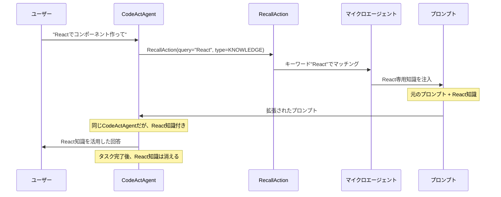
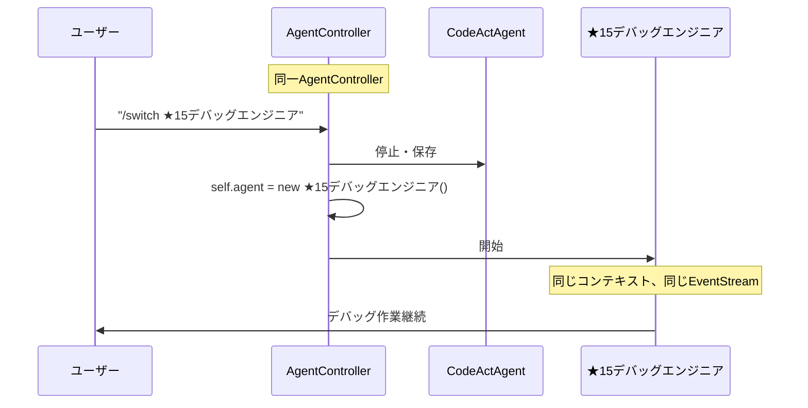
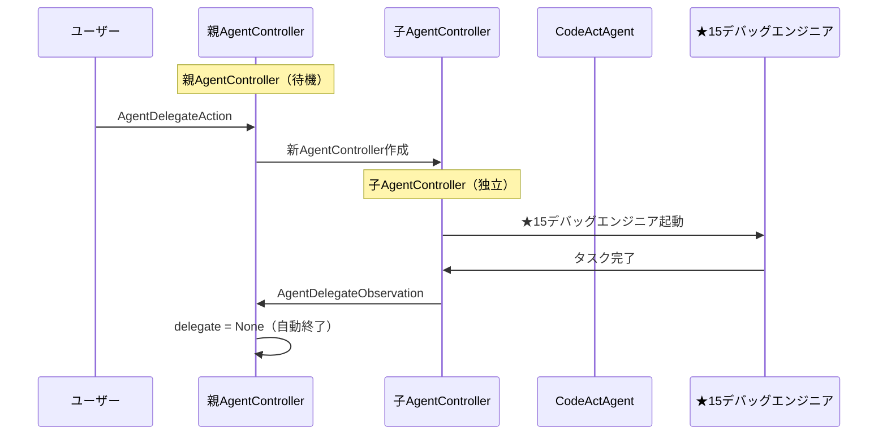

# 🔄 セッション内切り替え vs 委譲の根本的違い

> **重要な質問**: 「セッション内切り替えと委譲は何が違うの？」

## 📊 **根本的な違いの比較表**

| 項目 | マイクロエージェント | セッション内切り替え | 委譲（現在のシステム） |
|------|-------------------|-------------------|---------------------|
| **本質** | プロンプト拡張 | エージェント交換 | 階層的管理 |
| **制御権** | 変化なし | 完全移行（親は停止） | 一時的移譲（親は待機） |
| **階層構造** | なし | フラット（同一レベル） | 親子関係（階層的） |
| **終了制御** | 自動（一時的） | 手動制御 | 自動終了（タスク完了時） |
| **コンテキスト** | 一時的注入 | 共有・継承 | 分離・独立 |
| **AgentController** | 1つ（変化なし） | 1つ（交換） | 複数（親+子） |
| **EventStream** | 共有 | 共有 | 分離 |
| **delegate_level** | 変化なし | 変化なし | 増加 |
| **メモリ使用量** | 最軽量 | 軽量 | 重い |

---

## 🧩 **マイクロエージェントによるコンテクスト注入**

### 🎯 **基本概念**

**定義**: 特定のキーワードで**プロンプトに追加情報を注入**するシステム



### 🔧 **動作メカニズム**

**1. キーワード検出**
```python
# ユーザーメッセージ: "Reactでコンポーネント作って"
recall_action = RecallAction(
    query="Reactでコンポーネント作って",
    recall_type=RecallType.KNOWLEDGE
)
```

**2. マイクロエージェントマッチング**
```python
# React専用マイクロエージェント
microagent = KnowledgeMicroagent(
    name="react-expert",
    triggers=["react", "jsx", "component"],
    content="Reactのベストプラクティス: ..."
)

# マッチング
if microagent.match_trigger("Reactでコンポーネント作って"):
    # React知識をプロンプトに追加
```

**3. プロンプト拡張**
```jinja2
<!-- 元のプロンプト -->
あなたはCodeActAgentです。ユーザーの要求に応えてください。

<!-- マイクロエージェント注入後 -->
あなたはCodeActAgentです。ユーザーの要求に応えてください。

<EXTRA_INFO>
The following information has been included based on a keyword match for "react".
Reactのベストプラクティス:
- コンポーネントはPascalCaseで命名
- useStateでstate管理
- propsは読み取り専用
</EXTRA_INFO>
```

### ✅ **マイクロエージェントの特徴**

1. **エージェント不変**
   - CodeActAgentのまま
   - 知識のみ一時的に追加

2. **軽量・高速**
   - プロンプト拡張のみ
   - 最小限のオーバーヘッド

3. **自動的な知識提供**
   - キーワードで自動トリガー
   - ユーザーが意識する必要なし

4. **一時的な効果**
   - そのメッセージのみ有効
   - 継続的な効果なし

---

## 🔄 **セッション内切り替えの詳細**

### 🎯 **基本概念**

**定義**: 同一AgentController内でエージェント実体を**交換**するシステム



### 🔧 **実装メカニズム**

**1. エージェント交換**
```python
# セッション内切り替えの実装
class AgentController:
    def __init__(self):
        self.agent: Agent = CodeActAgent()  # 🔑 単一エージェント
        self.event_stream: EventStream = EventStream()
        self.state: State = State()
    
    async def switch_agent(self, target_agent: str):
        # 1. 現在のエージェント状態保存
        current_context = self.save_agent_context()
        
        # 2. エージェント交換（🔑 重要：同じコントローラー内）
        old_agent = self.agent
        self.agent = Agent.get_cls(target_agent)(
            llm=old_agent.llm,
            config=old_agent.config
        )
        
        # 3. コンテキスト復元
        self.restore_agent_context(current_context)
        
        # 4. 切り替え通知
        self.event_stream.add_event(
            AgentSwitchObservation(
                from_agent=old_agent.__class__.__name__,
                to_agent=target_agent
            )
        )
```

**2. 状態管理**
```python
# 同一コントローラー、同一状態
self.state.agent_state = AgentState.RUNNING  # 変化なし
self.state.delegate_level = 0  # 変化なし（委譲ではない）
self.state.history = [...]  # 共有履歴
```

### ✅ **セッション内切り替えの特徴**

1. **制御権の完全移行**
   - 親エージェントは完全に停止
   - 新エージェントが全制御権を取得

2. **フラットな構造**
   - 階層なし（親子関係なし）
   - 同一レベルでのエージェント交換

3. **コンテキスト継承**
   - 同じEventStream
   - 同じ履歴
   - 同じ状態

4. **手動制御**
   - ユーザーが明示的に切り替え
   - 自動終了なし

---

## 🏗️ **委譲システムの詳細**

### 🎯 **基本概念**

**定義**: 新しいAgentControllerを作成して**階層的に管理**するシステム



### 🔧 **実装メカニズム**

**1. 委譲開始**
```python
# 委譲システムの実装
class AgentController:
    def __init__(self):
        self.agent: Agent = CodeActAgent()
        self.delegate: AgentController | None = None  # 🔑 子コントローラー
        self.event_stream: EventStream = EventStream()
        self.state: State = State(delegate_level=0)
    
    async def start_delegate(self, action: AgentDelegateAction):
        # 1. 新しい状態作成（🔑 重要：独立した状態）
        delegate_state = State(
            session_id=self.id.removesuffix('-delegate'),
            delegate_level=self.state.delegate_level + 1,  # 階層増加
            start_id=self.event_stream.get_latest_event_id() + 1,
        )
        
        # 2. 新しいコントローラー作成（🔑 重要：別インスタンス）
        self.delegate = AgentController(
            sid=self.id + '-delegate',
            agent=Agent.get_cls(action.agent)(),
            is_delegate=True,
            initial_state=delegate_state,  # 独立した状態
        )
```

**2. 階層管理**
```python
# 親子関係の管理
def on_event(self, event: Event) -> None:
    if self.delegate is not None:  # 委譲中
        delegate_state = self.delegate.get_agent_state()
        if delegate_state in (AgentState.FINISHED, AgentState.ERROR, AgentState.REJECTED):
            self.end_delegate()  # 🔑 自動終了
            return
        else:
            self.delegate._on_event(event)  # 子に転送
            return
    
    # 委譲なしの場合は通常処理
    self._on_event(event)
```

### ✅ **委譲システムの特徴**

1. **制御権の一時移譲**
   - 親エージェントは待機状態
   - 子エージェントが一時的に制御

2. **階層構造**
   - 明確な親子関係
   - delegate_levelで階層管理

3. **コンテキスト分離**
   - 独立したEventStream
   - 独立した履歴
   - 独立した状態

4. **自動終了**
   - タスク完了で自動的に親に戻る
   - ユーザー制御不可

---

## 🎯 **具体的な動作比較**

### 🧩 **マイクロエージェントの動作**

```bash
# 初期状態
AgentController {
  agent: CodeActAgent,
  event_stream: [event1, event2, event3],
  state: { delegate_level: 0, history: [...] }
}

# ユーザーメッセージ
"Reactでコンポーネント作って"

# マイクロエージェント処理
RecallAction(query="React", type=KNOWLEDGE)
→ React専用マイクロエージェントがマッチ
→ プロンプトにReact知識を一時的に注入

# 処理後（エージェント・状態は不変）
AgentController {
  agent: CodeActAgent,  # 🔑 変化なし
  event_stream: [event1, event2, event3, recall_action, response],
  state: { delegate_level: 0, history: [...] }  # 🔑 変化なし
}

# 次のメッセージ
"TypeScriptでAPI作って"
→ TypeScript専用マイクロエージェントがマッチ
→ React知識は消え、TypeScript知識が注入
```

### 🔄 **セッション内切り替えの動作**

```bash
# 初期状態
AgentController {
  agent: CodeActAgent,
  event_stream: [event1, event2, event3],
  state: { delegate_level: 0, history: [...] }
}

# 切り替え実行
/switch ★15デバッグエンジニア

# 切り替え後
AgentController {
  agent: ★15デバッグエンジニア,  # 🔑 エージェントのみ変更
  event_stream: [event1, event2, event3, switch_event],  # 同じストリーム
  state: { delegate_level: 0, history: [...] }  # 同じ状態
}

# 継続作業
> バグ修正1
> テスト実行
> バグ修正2
> さらなる開発...
# 🎉 継続的に★15デバッグエンジニアとして動作
```

### 🏗️ **委譲システムの動作**

```bash
# 初期状態
ParentController {
  agent: CodeActAgent,
  delegate: null,
  event_stream: [event1, event2, event3],
  state: { delegate_level: 0 }
}

# 委譲実行
AgentDelegateAction(agent="★15デバッグエンジニア", inputs={task: "バグ修正"})

# 委譲中
ParentController {
  agent: CodeActAgent,  # 待機中
  delegate: ChildController {  # 🔑 新しいコントローラー
    agent: ★15デバッグエンジニア,
    event_stream: [delegate_start],  # 独立したストリーム
    state: { delegate_level: 1 }  # 階層増加
  }
}

# タスク完了
ChildController.agent.state = FINISHED

# 自動終了
ParentController {
  agent: CodeActAgent,  # 🔑 自動的に復帰
  delegate: null,  # 委譲終了
  event_stream: [event1, event2, event3, delegate_obs]
}
```

---

## 🎯 **ユーザーの要求に対する適用性**

### ❓ **ユーザーの要求**
> 「デバッグ → 確認 → さらなる開発の継続作業がしたい」

### ❌ **マイクロエージェントでは解決困難**
```
問題：
1. 一時的な知識提供のみ
2. エージェント自体は変わらない
3. 継続的な専門動作は不可能

例：
"バグを修正して" → デバッグ知識が一時的に注入
バグ修正完了 → デバッグ知識が消える
"さらにテストして" → 再度デバッグ知識を注入（非効率）
```

### ❌ **委譲では解決困難**
```
問題：
1. タスク完了で自動終了
2. 継続作業ができない
3. 毎回新しい委譲が必要

例：
バグ修正タスク → FINISHED → 自動的にCodeActAgentに戻る
さらなるデバッグ → 再度委譲が必要 → また自動終了...
```

### ✅ **セッション内切り替えで完全解決**
```
解決：
1. 手動制御で継続可能
2. 同じコンテキストで作業継続
3. エージェント固有の能力を継続利用

例：
/switch ★15デバッグエンジニア
バグ修正 → テスト → さらなるバグ発見 → 修正 → 新機能開発...
（★15デバッグエンジニアとして継続）
```

---

## 🚀 **実装の複雑さ比較**

### 🔄 **セッション内切り替え（シンプル）**

```python
# 必要な変更：最小限
class AgentController:
    async def switch_agent(self, target_agent: str):
        # エージェントフィールドを交換するだけ
        self.agent = Agent.get_cls(target_agent)()
```

**実装コスト**: 低
**リスク**: 最小
**効果**: 高

### 🏗️ **委譲システム（複雑）**

```python
# 既存の複雑な実装
class AgentController:
    async def start_delegate(self, action):
        # 新しいコントローラー作成
        # 状態管理
        # イベント転送
        # 自動終了制御
        # メモリ管理
        # ...（数百行のコード）
```

**実装コスト**: 高
**リスク**: 高
**効果**: 限定的（自動終了の制約）

---

## 🎯 **メモリ・パフォーマンス比較**

### 📊 **リソース使用量**

| 項目 | マイクロエージェント | セッション内切り替え | 委譲システム |
|------|-------------------|-------------------|-------------|
| **AgentController** | 1個（変化なし） | 1個 | 2個（親+子） |
| **EventStream** | 1個（変化なし） | 1個 | 2個（親+子） |
| **State** | 1個（変化なし） | 1個 | 2個（親+子） |
| **メモリ使用量** | 最軽量 | 軽量 | 重い |
| **処理オーバーヘッド** | 最小 | 最小 | 大きい |

### ⚡ **パフォーマンス**

```python
# マイクロエージェント：O(1)
prompt += microagent.content  # プロンプト拡張のみ

# セッション内切り替え：O(1)
self.agent = new_agent  # 単純な代入

# 委譲システム：O(n)
# - 新しいコントローラー作成
# - 状態初期化
# - イベントストリーム設定
# - 階層管理
# - 自動終了監視
```

---

## 🎯 **16エージェントシステムでの活用比較**

### 🧩 **マイクロエージェント活用**

```bash
# 知識提供型（自動）
openhands-cli --agent "CodeActAgent"
> "Reactでコンポーネント作って"  # React知識が自動注入
> "TypeScriptでAPI作って"      # TypeScript知識が自動注入
> "デバッグして"              # デバッグ知識が自動注入
# 各メッセージごとに適切な知識が一時的に提供
```

### 🔄 **セッション内切り替え活用**

```bash
# 継続的な専門作業
openhands-cli --agent "CodeActAgent"
> /switch ★1要件定義エンジニア
> 要件定義作業...
> /switch ★4バックエンド開発
> API開発...
> /switch ★15デバッグエンジニア
> バグ修正 → テスト → さらなる修正...（継続）
```

### 🏗️ **委譲システム活用**

```bash
# 単発タスク型
openhands-cli --agent "★16オーケストレーター"
> delegate to ★1要件定義エンジニア → 完了 → 自動終了
> delegate to ★4バックエンド開発 → 完了 → 自動終了
> delegate to ★15デバッグエンジニア → 完了 → 自動終了
# 毎回新しい委譲が必要
```

---

## 🎯 **結論：適用場面の使い分け**

### 🧩 **マイクロエージェントが最適**

✅ **自動的な知識提供**
- キーワードベースの知識注入
- ユーザーが意識しない補助
- 軽量・高速な動作

✅ **一時的な専門知識**
- 特定技術の知識提供
- フレームワーク固有の情報
- ベストプラクティスの提示

### 🔄 **セッション内切り替えが最適**

✅ **継続的な専門作業**
- デバッグ → テスト → さらなる開発
- UI/UX → デザイン → 改善 → さらなるデザイン
- バックエンド → API開発 → テスト → 拡張

✅ **ユーザー主導の制御**
- 自分のペースで作業
- 必要に応じてエージェント変更

✅ **軽量・高速な動作**
- 最小限のリソース使用
- 高速な切り替え

### 🏗️ **委譲システムが最適**

✅ **明確なタスク分割**
- 単発の専門タスク
- 自動的な作業分散

✅ **オーケストレーター制御**
- 自動的なエージェント選択
- タスク完了での自動復帰

### 🤝 **理想的な組み合わせ**

```bash
# Phase 1: オーケストレーターによる自動委譲
★16オーケストレーター → delegate to ★1要件定義エンジニア

# Phase 2: 継続作業が必要な場合はセッション内切り替え
/switch ★15デバッグエンジニア
> 継続的なデバッグ・開発作業...

# Phase 3: 専門エージェント + マイクロエージェントの組み合わせ
★15デバッグエンジニア + React知識マイクロエージェント
= 最強のReactデバッグ専門家
```

### 🎉 **最終回答**

**3つのシステムは全く異なる仕組み**：

- **マイクロエージェント**: プロンプト拡張による一時的知識提供
- **セッション内切り替え**: 同一コントローラー内でのエージェント交換
- **委譲**: 新しいコントローラーでの階層的管理

**ユーザーの継続作業要求には「セッション内切り替え」が最適解**で、**マイクロエージェントとの組み合わせで最強**になります！